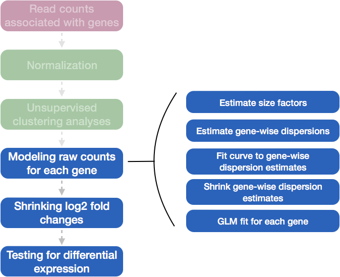

# DGE analysis workflow

Differential expression analysis with DESeq2 involves multiple steps as displayed in the flowchart below in blue. Briefly, DESeq2 will:

**Full Workflow in DESeq2:**

- Load Data: Begin with raw count data (gene expression counts) and sample metadata (information about the experimental conditions).

- Estimate Size Factors: Normalize counts across samples to account for differences in sequencing depth or library size, ensuring that comparisons between samples are meaningful.

- Estimate Gene-Wise Dispersions: Estimate the dispersion (a measure of variability) for each gene. This represents the variance in counts that cannot be explained by differences in mean expression alone.

- Fit a Global Trend for Dispersion: Model the relationship between the mean counts and the dispersion. DESeq2 allows this relationship to be fit either using a parametric model (default) or a non-parametric approach for highly variable genes.

- Shrink the Gene-Wise Dispersion Estimates: Shrink the gene-wise dispersion estimates toward the global trend using an empirical Bayes approach. This step stabilizes the estimates, especially for genes with low counts, improving reliability.

- Fit the Negative Binomial Model: Use the final shrunken gene-wise dispersion estimates to fit a negative binomial model for each gene. This model captures the counts' variability and provides estimates of log-fold changes in gene expression between conditions.

- Shrink the Log-Fold Changes: Optionally shrink the log-fold changes using a regularization technique to stabilize the estimates, especially for low-expression genes.

- Perform Statistical Testing: Conduct statistical tests to identify genes that are differentially expressed between conditions. DESeq2 uses a Wald test to assess the significance of the log-fold changes and provides adjusted p-values to account for multiple testing.

{ width=600 }

This final step in the differential expression analysis workflow of fitting the raw counts to the NB model and performing the statistical test for differentially expressed genes, is the step we care about. This is the step that determines whether the mean expression levels of different sample groups are significantly different.

{ width=600 }

The [DESeq2 paper](https://genomebiology.biomedcentral.com/articles/10.1186/s13059-014-0550-8) was published in 2014, but the package is continually updated and available for use in R through Bioconductor. 

## Running DESeq2

Prior to performing the differential expression analysis, it is a good idea to know what **sources of variation** are present in your data, either by exploration during the QC and/or prior knowledge. Once you know the major sources of variation, you can remove them prior to analysis or control for them in the statistical model by including them in your **design formula**.

### Set the Design Formula
The design formula tells DESeq2 which known sources of variation to control for during the analysis, as well as the factor of interest to test for differential expression. For example, if you know that sex is a significant source of variation in your data, it should be included in the model. The design formula includes all relevant factors from your metadata that may explain variability in your data, with the factor of interest being the last term in the formula.

**Example**
Suppose you have metadata that includes **sex**, **age**, and **treatment** as shown below:For example, suppose you have the following metadata:

{ width=300 }

If you want to examine differences in gene expression between **treatment** conditions, and you know that **sex** and **age** are major sources of variation, your design formula would look like this:

`design <- ~ sex + age + treatment`

Here, the tilde (~) indicates the formula structure in R, telling DESeq2 to model the counts while accounting for the effects of **sex** and **age**, and testing for differences between **treatment groups**. The factors included in the design formula should exactly match the column names in the metadata.

**Why is this important?**
By including known sources of variation (such as **sex** and **age**) in the design, DESeq2 can adjust for their effects, ensuring that any differences observed in gene expression are due to the biological condition of interest (in this case, **treatment**) and not confounded by other factors like **sex** or **age**. The comparison between **treatment** and **control** is still performed in the results() function, but it now accounts for these additional factors.
***

**Exercise** points = +3

1. Suppose you wanted to study the expression differences between the two age groups in the metadata shown above, and major sources of variation were `sex` and `treatment`, how would the design formula be written?

```{r, eval = FALSE}

# Your code here

```

```{r, results = "asis", echo = FALSE}

solutions(
  '# `DESeq2::results` defaults to the last factor in the formula, so your condition of interest should come last:\n
     ~ sex + treatment + age'
)

```

2. Based on our Mov10 metadata dataframe, which factors could we include in our design formula?

  - Ans: 

```{r, results = "asis", echo = FALSE}
solutions("sampletype, you could also use MOVexpr, but it is 
           redundant with sampletype. Sampletype is also 
           more descriptive.")
```


3. What would you do if you wanted to include a factor in your design formula that is not in your metadata?

  - Ans: 
  
```{r, results = "asis", echo = FALSE}

solutions(
  "Add the factor as an additional column in the metadata points"
)

```

***

### MOV10 Differential Expression Analysis
Now that we understand how to specify the model in DESeq2, we can proceed with running the differential expression pipeline on the raw count data.

**Running Differential Expression in Two Lines of Code**
To obtain differential expression results from our raw count data, we only need to run two lines of code!

First, we create a DESeqDataSet, as we did in the ['Count normalization'](https://hbctraining.github.io/DGE_workshop/lessons/02_DGE_count_normalization.html#2-create-deseq2-object) lesson, specifying the location of our raw counts and metadata, and applying our design formula:

```{r}
## Create DESeq object
dds <- DESeqDataSetFromMatrix(countData = data, colData = meta, design = ~ sampletype)
```

Next, we run the actual differential expression analysis with a single call to the `DESeq()` function. This function handles everything—from **normalization** to **linear** modeling—all in one step. During execution, DESeq2 will print messages detailing the steps being performed: estimating size factors, estimating dispersions, gene-wise dispersion estimates, modeling the mean-dispersion relationship, and statistical testing for differential expression.

```{r}
## Run analysis
dds <- DESeq(dds)
```

By re-assigning the result to back to the same variable name (`dds`), we update our `DESeqDataSet` object, which will now contain the results of each step in the analysis, effectively filling in the `slots` of our `DESeqDataSet` object.


## DESeq2 differential gene expression analysis workflow

With these two lines of code, we have completed the core steps in the DESeq2 differential gene expression analysis. The key steps in this workflow are summarized below:

{ width=200 }

In the following sections, we will explore each step in detail to better understand how DESeq2 performs the statistical analysis and what metrics we should focus on to evaluate the quality of the results.

### Step 1: Estimate size factors

The first step in the differential expression analysis is to estimate the size factors, which is exactly what we already did to normalize the raw counts. 

{ width=200 }

DESeq2 will automatically estimate the size factors when performing the differential expression analysis. However, if you have already generated the size factors using `estimateSizeFactors()`, as we did earlier, then DESeq2 will use these values.

To normalize the count data, DESeq2 calculates size factors for each sample using the *median of ratios method* discussed previously in the Count normalization (Chapter \@ref(count-normalization)) lesson.

#### MOV10 DE analysis: examining the size factors

Let's take a quick look at size factor values we have for each sample:

```{r}
## Check the size factors
sizeFactors(dds)

```
 
Take a look at the total number of reads for each sample:

```{r}
## Total number of raw counts per sample
colSums(counts(dds))
```

*How do the numbers correlate with the size factor?*

### Step 2: Estimate gene-wise dispersion

The next step in differential expression analysis is estimating the gene-wise dispersions. Before diving into the details of how DESeq2 estimates these values, it’s important to understand what dispersion means in the context of RNA-Seq analysis.

{ width=200 }

**What is dispersion?** 
Dispersion is a measure of variability or spread in the data. Common measures of dispersion include variance, standard deviation, and interquartile range (IQR). However, in DESeq2, dispersion (denoted as $\alpha$) is specifically related to the relationship between the mean ($\mu$) and variance (Var) of the data:

$$Var = \mu + \alpha \mu^2$$

**What does the DESeq2 dispersion represent?** 
Dispersion in DESeq2 reflects the variability in gene expression for a given mean count. It is **inversely related to the mean** and **directly related to variance**. This means that genes with lower mean counts tend to have higher dispersion, while genes with higher mean counts tend to show lower dispersion.

Dispersion estimates for genes with the same mean will differ based on their variance, making dispersion an important metric for understanding the variability in expression across biological replicates.

The plot below shows the relationship between **mean** and **variance** in gene expression. Each black dot represents a gene. Notice that for genes with higher mean counts, the variance can be predicted more reliably. However, for genes with low mean counts, the variance has a wider spread, and the dispersion estimates tend to vary more.

{ width=600 }

**How does the dispersion relate to our model?** 
To accurately model sequencing counts, it’s critical to estimate within-group variation (variation between replicates within the same experimental group) for each gene. However, with small sample sizes (e.g., 3-6 replicates per group), gene-specific estimates of variation can be unreliable, particularly for genes with similar mean counts but differing dispersions.

To address this, DESeq2 **shares information across genes** with similar expression levels to improve dispersion estimates. This is done through a process called **shrinkage**, which assumes that genes with similar mean expression tend to have similar dispersion. By borrowing strength from the entire dataset, DESeq2 produces more accurate estimates of variation.

**Estimating the dispersion for each gene separately:**
DESeq2 uses the negative binomial (NB) distribution to model count data in RNA-Seq experiments. The NB distribution accounts for the overdispersion observed in real biological data, where the variance tends to be greater than the mean. The two key parameters of the NB distribution are the mean expression level and the dispersion, which quantifies the extra variability beyond what is expected under a Poisson distribution.

For each gene \( i \), the observed count $Y_{ij}$ in sample \( j \)  is modeled as:

$$
Y_{ij} \sim \text{NB}\left(\mu_{ij}, \alpha_{i}\right)
$$
Where:

- \( Y_{ij}\) is the observed count for gene \( i \) in sample \( j \)

- \( \mu_{ij}\) = is the expected normalized count for gene \( i \) in sample \( j \) and is equal to the sizeFactor_{j} \times q_{i} where q_{i} is the true expression level of gene \( i \) 

- \( \alpha_i \) is the dispersion parameter for gene \( i \) 

- \( sizeFactor{j} \) normalizes the counts for differences in sequencing depth across samples

This model captures both the variability in sequencing depth (through the size factor) and the biological variability across genes (through the dispersion).

The dispersion parameter \( \alpha_{i} \) represents the extra-Poisson variability in the data. It accounts for the biological and technical variability that is not explained by the mean expression level. The dispersion is crucial for accurately modeling the count data and identifying differentially expressed genes and accounts for how much variability exceeds the mean.

**Dispersion Estimation Using Maximum Likelihood**
To estimate the dispersion parameter for each gene, DESeq2 uses maximum likelihood estimation (MLE). The goal of MLE is to find the value of \( \alpha_{i} \) that maximizes the likelihood of observing the data, given the negative binomial model. 

The log-likelihood function for the negative binomial distribution  which is used to estimate both the mean ($\mu$) and dispersion ($\alpha$) parameters, is given by:

$$
\log L(Y_{ij}| \mu_ij, \alpha_i) = \log \left( \frac{\Gamma(Y_{ij}+ \frac{1}{\alpha_i})}{\Gamma(Y_ij+1) \Gamma(\frac{1}{\alpha_i})} \right) + Y_{ij}\log \left( \frac{\alpha_i \mu_{ij}}{1 + \alpha_i \mu_{ij}} \right) - \frac{1}{\alpha_i} \log(1 + \alpha_i \mu_{ij})
$$
Where:

- \( Y_{ij}\) is the observed count for gene \( i \) in sample \( j \)

- \( \mu_{ij}\) is the mean normalized count for gene \( i \) in sample \( j \)

- \( \alpha_i \) is the dispersion parameter for gene i

- \(⋅\Gamma \): Gamma function, which arises from the negative binomial distribution..

The dispersion is estimated by maximizing the likelihood of observing the counts $Y_{ij}$ based on the mean ($\mu_{ij}$) and variance $\mu_{ij} + \alpha \mu_{ij}^2$).

This log-likelihood is maximized to obtain the most likely value of dispersion for each gene. Essentially, this process seeks to find the dispersion parameter that best explains the observed variability in the count data.

**The initial raw dispersion estimate:** 

The variance of the observed $Y_{ij}$ in the negative binomial model is given by:

$$
V(Y_{ij}) = \mu_{ij} + \alpha_{i} \mu_{ij}^2
$$
Where:
- \( V(Y_{ij}) \) is the variance of counts for gene \( i \) in sample \( j \)
- \( \mu_{ij} \) is the mean normalized count for gene \( i \) in sample \( j \)
- \( \alpha_{i}\) is the dispersion parameter for gene \( i \), which captures the extent of overdispersion (how much the variance exceeds the mean). 

This equation shows that the variance increases with the mean, and the extent of that increase is controlled by the dispersion parameter $\alpha_{i}$. The larger the dispersion, the more the variance increases as the mean increases, indicating greater variability in the gene expression data.

**Solving for the Initial Dispersion Estimate:**
We can rearrange the variance equation to solve for the initial estimate of dispersion $\alpha_{i}$:

$$
\alpha_{i} = \dfrac{V(Y_{ij}) - \mu_{ij}}{\mu_{ij}^2 \vphantom{\dfrac{A}{B}}}
$$

Where:
- \( V(Y_{ij}) \) is the observed variance of gene \( i \) in sample \( j \)
- \( \mu_{ij} \) the expected mean normalized count for gene \( i \) in sample \( j \)
- \( \alpha_{i} \) is the initial estimate of the dispersion parameter for gene \( i \).which represents the degree of overdispersion (the extent to which the variance exceeds the mean).

This equation provides an estimate of dispersion for each gene based on the observed variance in the count data. This initial estimate is later refined as part of the dispersion fitting process.

{ width=200 }
### Step 3: Fit Curve to Gene-Wise Dispersion Estimates
Fitting the Global Dispersion Trend:
Once the initial gene-wise dispersion estimates ($\alpha_{i}$) are obtained, a global trend is fit to model how dispersion typically changes as a function of the mean expression ($\mu_{i}$) across all samples. This trend is used to account for the general pattern that genes with low mean expression tend to have higher dispersion, while highly expressed genes have lower dispersion.

The global trend provides the expected dispersion value given the expression level of a gene. Different genes have varying biological variability, but across all genes, there is a consistent relationship between expression and dispersion. Fitting a curve allows DESeq2 to smooth the variability and better estimate dispersion for each gene.

This trend is particularly important because lowly expressed genes often show greater variability, and highly expressed genes tend to have more stable counts (less variability).

{ width=200 }

**Visual representation of the global dispersion trend:**
The red line in the plot below shows the global trend, which represents the expected dispersion value for genes of a given expression level. Each black dot corresponds to a gene, plotted with its mean expression and initial dispersion estimate from maximum likelihood estimation (Step 1).

{ width=400 }


{ width=200 }
**Understanding the Parametric Dispersion Trend**
Once the initial gene-wise dispersion estimates are obtained, DESeq2 fits a parametric trend to model how dispersion changes with mean expression across all genes. This relationship is typically characterized by lower dispersion for highly expressed genes and higher dispersion for lowly expressed genes, as commonly observed in RNA-Seq data.

The parametric trend is described by the formula:

$$\alpha(\mu) = \alpha_{0} + \frac{\alpha_{i}}{\mu}$$
Where:
- \( \alpha(\mu) \) is the dispersion as a function of the mean count \( \mu \).
- \( \alpha_0 \) is the baseline dispersion for highly expressed genes.
- \( \alpha_1 \) determines how rapidly dispersion increases for lowly expressed genes as the mean count decreases.

This model assumes that dispersion decreases as the mean expression increases, a pattern typical in RNA-Seq experiments. The trend is fit to the raw dispersion estimates using non-linear least squares regression, where the parameters $\alpha_{0}$ and $\alpha_{1}$ are estimated by minimizing the differences between the observed dispersions and the predicted values from the model.

By capturing this global relationship between mean counts and dispersion, DESeq2 can borrow strength across genes. This improves the stability of dispersion estimates, particularly for genes with fewer counts or more variability, ensuring more reliable results. After the trend is fitted, the gene-wise dispersions are shrunken toward the curve to finalize the estimates used for differential expression testing.

### Step 4: Shrink Gene-Wise Dispersion Estimates Toward the Global Trend
To improve the reliability of the dispersion estimates, DESeq2 applies empirical Bayes shrinkage, which pulls the gene-specific dispersion estimates toward the global trend. This process ensures that dispersions for genes with low or moderate counts, where estimates are typically noisier, become more stable and accurate.

{ width=200 }
The amount of shrinkage applied to each gene's dispersion depends on two factors:

**How close the gene's dispersion is to the global trend:** Genes whose dispersions are close to the curve undergo minimal shrinkage, while those further away are shrunk more.

**Sample size:** Genes in experiments with larger sample sizes experience less shrinkage because their dispersion estimates are already more stable.

**Why Shrinkage Matters:**
Shrinkage is crucial for **reducing false positives** in differential expression analysis. Genes with low or moderate dispersion estimates are pulled up toward the curve, making the estimates more reliable for subsequent model fitting and differential expression testing.

Even dispersions slightly above the curve are shrunk toward the trend for consistency. However, genes with **extremely high dispersion values** (potential outliers) are typically not shrunk. These genes may exhibit higher variability due to biological or technical reasons, and shrinking them could lead to false positives. These outlier genes are highlighted by blue circles in the plot below:
	
{ width=600 }
**Assessing Model Fit:**
This dispersion plot is a useful diagnostic tool to check if your data fits the DESeq2 model. Ideally, your gene dispersions should scatter around the curve, with dispersion decreasing as mean expression increases. If you observe an unusual pattern, such as a cloud of points or a shape inconsistent with the trend, it might suggest issues like contamination (e.g., mitochondrial genes) or problematic samples.

You can use the `plotDispEsts()` function in DESeq2 to evaluate the extent of shrinkage across the range of mean expression levels, especially in experiments with low degrees of freedom.

**Examples of Problematic Dispersion Plots:**
Below are examples of worrisome dispersion plots that suggest potential issues with data quality or fit:

Examples of **worrisome dispersion plots** are shown below:

{ width=600 }

{ width=600 }

### MOV10 Differential Expression Analysis: Exploring Dispersion Estimates
Now, let's explore the dispersion estimates for the MOV10 dataset:

```{r}
## Plot dispersion estimates
plotDispEsts(dds)
```

**Since we have a small sample size, for many genes we see quite a bit of shrinkage. Do you think our data are a good fit for the model?**

***


### Accurate Dispersion Estimation in DESeq2

In DESeq2, dispersion represents the variability of gene expression that is not explained by the experimental condition. It plays a crucial role in identifying differentially expressed genes by quantifying the biological variability between samples.

1. **Initial Dispersion Estimation**:
   DESeq2 calculates raw dispersions by fitting the counts for each gene to a negative binomial (NB) distribution. The dispersion parameter (alpha) represents the extra-Poisson variability that accounts for biological and technical variation in the data. This is modeled by:
   
   Var(Y_ij) = mu_ij + alpha_j * mu_ij^2
   where mu_ij is the mean expression for gene j in sample i, and alpha_j is the gene-specific dispersion parameter. 

2. **Empirical Bayes Shrinkage**:
   After calculating raw dispersions, DESeq2 applies empirical Bayes shrinkage, which shrinks the gene-wise dispersion estimates towards a global trend. This makes the estimates more stable, especially for genes with low counts or high variability. The shrinkage is particularly useful to avoid overfitting and to ensure more robust statistical testing.

3. **MLE for Dispersion Estimation**:
   DESeq2 uses Maximum Likelihood Estimation (MLE) to fit the dispersion parameter by maximizing the likelihood of the observed counts, given the negative binomial model. This method optimizes alpha_j to ensure that the estimated variance reflects both biological noise and the true differences in expression.


### Beta Coefficient Estimation in DESeq2

DESeq2 estimates the beta coefficients (beta_j) for each gene, which represent the log fold changes in gene expression between different experimental conditions. These coefficients are used to identify genes that are differentially expressed.

1. **MLE for Beta Coefficients**:
   The normalized counts are modeled as a function of the design matrix and beta coefficients using the equation:
   
   log(mu_ij) = X_i * beta_j
   where X_i represents the design matrix for sample i, and beta_j are the coefficients for gene j. The beta coefficients reflect the changes in expression levels between conditions.

2. **Regularization (Optional)**:
   To avoid overly large fold-change estimates, DESeq2 provides an option to shrink beta coefficients using regularization techniques like LFC (Log Fold Change) shrinkage. This ensures that the estimates are more stable and interpretable, especially for low-expression genes.

This explanation outlines the key processes in DESeq2 for accurately estimating dispersions and beta coefficients, ensuring robust identification of differentially expressed genes.
