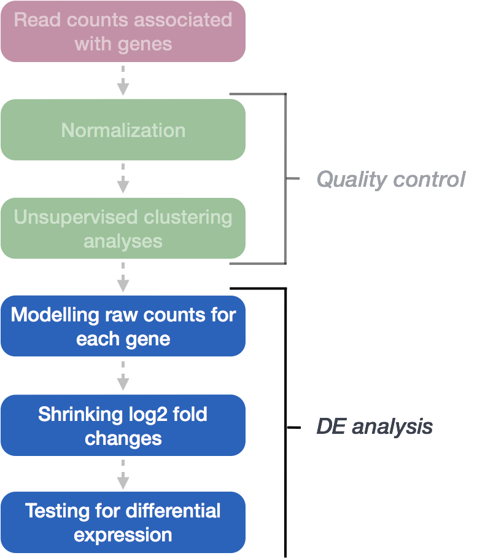

# Model and hypothesis testing

## Fitting the Generalized Linear Model for Each Gene

The final step in the DESeq2 workflow involves fitting a Negative Binomial (NB) model to each gene’s expression data and performing differential expression testing.

{ width=400 }

**Modeling RNA-Seq Counts**

As mentioned in the previous chapter DESeq2 uses the negative binomial (NB) distribution to is to obtain dispersion estimates for each gene. The dispersion parameter for each gene is estimated through maximum likelihood estimation (MLE). This method seeks to find the value of $\alpha_{i}$ that maximizes the likelihood of observing the counts $Y_{ij}$, given the model.

The general form of the negative binomial model is shown below:

$$
Y_{ij} \sim \text{NB}\left(\mu_{ij}, \alpha_{i}\right)
$$
Where:

- \( Y_{ij}\) is the observed count for gene \( i \) in sample \( j \)


- \( \mu_{ij}\) is the expected normalized count for gene \( i \) in sample \( j \). 


- \( \alpha_{i}\) is the gene-specific dispersion parameter for gene \( i \).

The first step in estimating dispersion is to obtain dispersion estimates for each gene. The dispersion parameter for each gene is estimated through maximum likelihood estimation (MLE). This method seeks to find the value of $\alpha_{i}$ that maximizes the likelihood of observing the counts $Y_{ij}$, given the model. In other words, MLE identifies the $\alpha_{i}$ that best explains the observed variability for gene $i$.

DESeq2 models RNA-Seq count data using the negative binomial (NB) distribution. As we saw in the last chapter, irst, it estimates the overdispersion ($\alpha_{i}$) a common feature of biological data where the variance exceeds the mean. The two primary parameters of the NB model are the mean expression level and the dispersion, which respectively capture the expected gene counts and the variability across replicates.

For each gene \( i \), the observed count $Y_{ij}$ in sample \( j \)  is modeled as:


As mentioned in the previous chapter DESeq2 first models RNA-Seq count by fitting the negative binomial (NB) distribution to estimate the dispersions $\alpha_{i}$ for each gene.

$\alpha_{i}$ is a common feature of biological data where the variance exceeds the mean. DESeq2 first uses a **negative binomial generalized linear model (GLM)** to estimate the dispersions for each gene. A GLM is a flexible statistical framework similar to linear regression, but it can handle data that doesn't follow a normal distribution, such as count data. DESeq2 firsts fits the NB model to estimate the **mean expression** and **dispersion** for each gene.

The general form of the negative binomial model is shown below:

$$
Y_{ij} \sim \text{NB}\left(\mu_{ij}, \alpha_{i}\right)
$$
Where:

- \( Y_{ij}\) is the observed count for gene \( i \) in sample \( j \)


- \( \mu_{ij}\) is the expected normalized count for gene \( i \) in sample \( j \). 


- \( \alpha_{i}\) is the gene-specific dispersion parameter for gene \( i \).

This is modeled as:
  
  $$\mu_{ij} = sizeFactor_{j} \times q_{ij}$$
  
Where:

- \( sizeFactor_{j}\) normalizes for differences in sequencing depth across samples.

- \( q_{ij}\) represents the true underlying expression level of gene \( i \) in sample \( j \), which is usually modeled as a function of covariates (such as experimental conditions or sample groups).

- \( \alpha_{i}\) is the dispersion parameter for gene \( i \), which accounts for the variability in counts beyond what would be expected under a Poisson model (i.e., overdispersion). 

**Step 1: Estimating Gene-wise Dispersion and Regression Coefficients**
As mentioned in the previous chapter, DESeq2 models RNA-Seq count data by fitting the negative binomial (NB) distribution to estimate the dispersion parameter $\alpha_{i}$ for each gene. Dispersion, $\alpha_{i}$, reflects the variability in RNA-Seq data where the variance exceeds the mean. DESeq2 uses a negative binomial generalized linear model (GLM) to estimate the dispersions for each gene. A GLM is similar to linear regression but is more flexible, accommodating data that doesn’t follow a normal distribution—such as count data from RNA-Seq experiments.

**Modeling the Negative Binomial Distribution**
DESeq2 first fits the NB model to estimate the mean expression and dispersion for each gene. The general form of the negative binomial model is:

$$Var(Y_{ij})  = {\mu_{ij} + \alpha_{i}}{\mu_{ij}^2}$$
Where:

- \( Var(Y_{ij}\) is the variance for gene \( i \) in sample \( j \).

- \( \mu_{ij}\) is the expected normalized count for gene \( i \) in sample \( j \).

- \( \alpha_{i}\) is the gene-specific dispersion parameter.

Once the dispersion parameter $\alpha_{i}$ is estimated for each gene, DESeq2 refits the negative binomial model to estimate the regression coefficients $\beta$, while keeping the dispersion fixed. These coefficients represent the log2 fold changes in gene expression between different experimental conditions.

**Estimating Regression Coefficients $\beta$**

The regression coefficients $\beta$ are determined for each sample group using maximum likelihood estimation (MLE), which maximizes the likelihood of observing the data under the negative binomial model. The $\beta$ values describe the relationship between the mean expression $\mu_{i}$ and the experimental conditions (e.g., treated vs. control).

The expected mean expression $\mu_{ij}$ for gene $i$ in sample $j$ is modeled as a function of the covariates in the design matrix $X_{ij}$ and the regression coefficients $\beta$:

$$log(\mu_{ij}) = X_{ij} \beta$$
or equivalently:

$$\mu_{ij} = exp{X_{ij} \beta}$$

Where:

- \( \mu_{ij}\) is the expected normalized count for gene \( i \) in sample \( j \).

- \( X_{ij}\) represents the covariates (design matrix) for gene \( i \) in sample \( j \)

- \( \beta\) is the vector of coefficients (log2 fold changes) for the covariates.

**Interpreting the Regression Coefficients**

In the case of our dataset, the design has three levels, and the model can be written as:

$$
y = \beta_0 + \beta_1 x_{mov10kd} + \beta_2 x_{mov10oe}
$$

Where:

* $y$ is the **log2 of the fitted counts** for each gene

* $\beta_0$ is the **log2 average** of the reference group (e.g. “control”)

* $\beta_1$ is the **log2 fold change** between “Mov10_kd” and the reference group “control”

* $\beta_2$ is the **log2 fold change** between “Mov10_oe” and the reference group “control”

* $x_{mov10kd}$ and $x_{mov10oe}$ are indicators of whether a sample belongs to the "Mov10_kd" or "Mov10_oe" groups, respectively.

**Log2 Fold Changes and Adjustments**

The $\beta$ coefficients represent the **log2 fold changes** for each sample group. However, **log2 fold changes** tend to be noisier when counts are low due to the large dispersion. To stabilize these estimates, DESeq2 adjusts the log2 fold changes through a process known as shrinkage.

**Shrunken Log2 Fold Changes (LFC)**

**Why Are Shrunken Log2 Fold Changes Used in DESeq2?**

Genes with low counts or high variability often produce large or erratic log2 fold change (LFC) estimates, even when the actual difference between conditions is small. These noisy estimates can skew downstream analyses. To address this, DESeq2 applies Empirical Bayes shrinkage to bring extreme log2 fold changes closer to more reasonable values.

**How Does Shrinkage Work?**

Similar to how dispersion shrinkage works, DESeq2 stabilizes log2 fold change estimates by leveraging information from all genes. A normal distribution is fitted to the LFC estimates, which serves as a prior. This prior is used to shrink the estimates for genes with high variability, pulling noisy LFC estimates closer to the global average.

Genes with low counts or high dispersion undergo more shrinkage, while genes with more reliable data undergo less.

**Statistical Testing of LFC: Wald Test**

DESeq2 uses the **Wald test** to test the significance of the log2 fold change for each gene. The test compares the estimated LFC to its **standard error** to assess whether the difference in gene expression between conditions is statistically significant.

1. The log2 fold change is divided by its standard error to produce a **z-statistic**.

2. The z-statistic is compared to a standard normal distribution to calculate the p-value.

3. A small p-value indicates evidence of differential expression.

**Modeling the Negative Binomial Distribution**
DESeq2 first fits the NB model to estimate the mean expression and dispersion for each gene. The general form of the negative binomial model is:

Once the dispersion parameter $\alpha$ has been estimated for each gene, DESeq2 refits the negative binomial model to estimate the regression coefficients $ \beta $, while keeping the dispersion fixed. These coefficients represent the log2 fold changes in gene expression between different experimental conditions. These coefficients $ \beta $ are determined for each sample group using maximum likelihood estimation (MLE), which maximizes the log-likelihood of the Negative Binomial distribution. The $ \beta $ values describe the relationship between the mean expression $ \mu_i $ and the experimental conditions (e.g., treated vs. control).

The expected mean expression $ \mu_{ij} $ for gene $ i $ in sample $ j $ is modeled as a function of the covariates in the design matrix $ X_{ij} $ and the regression coefficients $ \beta $:

$$log(\mu_{ij}) = X_{ij} \beta$$
or equivalently:

$$\mu_{ij} = exp{X_{ij} \beta}$$

Where:


- \( \mu_{ij}\) is the expected normalized count for gene \( i \) in sample \( j \).

- \( X_{ij}\) represents the covariates (design matrix) for gene \( i \) in sample \( j \)

- \( \beta\) is the vector of coefficients (log2 fold changes) for the covariates.

The log-likelihood function for the regression coefficients $ \beta $ is maximized by substituting the mean expression $ \mu_{ij} $ with $ exp{X_{ij} \beta} $ into the negative binomial model. This process estimates the $ \beta $ values that best describe the relationship between the experimental conditions and gene expression levels.

**Estimating Coefficients Using Maximum Likelihood**

The mean expression ($\mu_{i}$) is modeled as a function of the covariates in the design matrix ($X_{i}$) and the regression coefficients ($\beta$):

$$log(\mu_{ij}) = X_{ij} \beta$$

or equivalently:

$$\mu_{ij} = exp{X_{ij} \beta}$$

Where:

- \( \mu_{ij}\) is the expected count for gene \( i \) in sample \( j \)

- \( X_{ij}\) represents the covariates (design matrix) for gene \( i \) and sample \( j \)

- \( \beta\) is the vector of coefficients (log2 fold changes) for the covariates


The log-likelihood for the regression coefficients $\beta$ is maximized by substituting the mean ($\mu_{ij}$) with $exp{X_{ij} \beta}$ into the negative binomial likelihood function.

After the model is fit, coefficients are estimated for each sample group along with their standard error.

In the case of our dataset, the design has three levels, and the model can be written as:

$$
y = \beta_0 + \beta_1 x_{mov10kd} + \beta_2 x_{mov10oe}
$$

Where:

* $y$ is the **log2 of the fitted counts** for each gene

* $\beta_0$ is the **log2 average** of the reference group (e.g. “control”)

* $\beta_1$ is the **log2 fold change** between “Mov10_kd” and the reference group “control”

* $\beta_2$ is the **log2 fold change** between “Mov10_oe” and the reference group “control”

* $x_{mov10kd}$ and $x_{mov10oe}$ are indicators of whether a sample belongs to the "Mov10_kd" or "Mov10_oe" groups, respectively.

The $\beta$ coefficients are the estimates for the **log2 fold changes** for each sample group. However, **log2 fold changes** are inherently noisier when counts are low due to the large dispersion we observe with low read counts. To avoid this, the **log2 fold changes calculated by the model need to be adjusted**. 

**Log2 Fold Change and Adjustments**

The estimated $\beta$ coefficients represent the log2 fold changes in gene expression between different experimental conditions. However, when gene counts are low, these estimates can be more variable, and additional adjustments may be needed to stabilize the results.

## Shrunken Log2 Fold Changes (LFC)

To generate more accurate LFC estimates, DESeq2 allows for the **shrinkage of the LFC estimates toward zero** when the information for a gene is low, which could include:

- Low counts
- High dispersion values

As with the shrinkage of dispersion estimates, LFC shrinkage uses **information from all genes** to generate more accurate estimates. Specifically, the distribution of LFC estimates for all genes is used (as a prior) to shrink the LFC estimates of genes with little information or high dispersion toward more likely (lower) LFC estimates. This process helps to stabilize the LFC estimates and reduce the impact of outliers or noisy data.


{ width=500 }

*Illustration taken from the [DESeq2 paper](https://genomebiology.biomedcentral.com/articles/10.1186/s13059-014-0550-8).*

In the figure above, both the green and purple genes have the same mean values across two sample groups (C57BL/6J and DBA/2J), but the green gene shows little variation while the purple gene has high variation. The **shrunken log2 fold change** for the green gene (dotted line) is nearly the same as its **unshrunken estimate** (vertex of the green **solid line**). However, the LFC estimates for the purple gene is pulled much closer to the prior distribution (black line) due to its higher dispersion.

**Generating Shrunken LFC Estimates**

To generate shrunken log2 fold change estimates, you can run the `lfcShrink()` function on your results object:

```{r, eval = FALSE}
shrunken_results <- lfcShrink(dds, contrast = c("condition", "treated", "control"), res = results)
```


**DESeq2 Workflow Overview:**

In DESeq2, the Wald test is an integral part of the hypothesis testing procedure. The overall workflow follows these steps:

1. Estimate Size Factors
2. Estimate Dispersions
3. Fit the Negative Binomial GLM
4. Perform Hypothesis Testing (using the Wald test for LFC estimates)

**Creating Contrasts for Hypothesis Testing**

In DESeq2, **contrasts** define the specific groups to compare for differential expression testing. There are two ways to create contrasts:

**Default Comparison:**

DESeq2 automatically uses the base level of the factor of interest, determined alphabetically, as the **baseline for comparisons (reference)**.

**Manual Specification:**

You can manually specify the contrast using the `contrast` argument in the `results()` function. **The last group in the contrast becomes the base for comparison (reference).**

	
```{r, eval = FALSE}
	
	# DO NOT RUN!
	contrast <- c("condition", "level_to_compare", "base_level")
	results(dds, contrast = contrast, alpha = alpha_threshold)
	
```

The `alpha` parameter in DESeq2 sets the significance cutoff used for optimizing independent filtering. The `alpha` value is used to determine the criteria for independent filtering, meaning DESeq2 will try to optimize the filtering process to maximize the number of genes with adjusted p-values below the `alpha` threshold.
The filtering step removes genes that are unlikely to achieve an adjusted p-value (FDR) below this `alpha` value (i.e., those with low counts or low statistical power). However, the primary criterion used for independent filtering is the mean normalized count of the genes.

By default, `alpha` is set to 0.1, meaning that genes with an adjusted p-value (false discovery rate, or FDR) below this threshold will be considered significant. However, you can adjust the `alpha`  parameter to reflect a more stringent FDR threshold, such as 0.05, depending on your analysis needs.

### MOV10 DE Analysis: Contrasts and Wald Tests

In our MOV10 dataset, there are three groups, allowing for the following pairwise comparisons:

1. **Control vs. Mov10 overexpression**
2. **Control vs. Mov10 knockdown**
3. Mov10 knockdown vs. Mov10 overexpression

For this analysis, **we are primarily interested in comparisons #1 and #2.** The design formula we provided earlier (~ sampletype) defines our main factor of interest.

**Building the Results Table**

To build the results table, we use the `results()` function. You can specify the `contrast` to be tested using the contrast argument. In this example, we’ll save the unshrunken and shrunken results of **Control vs. Mov10 overexpression** to different variables. We’ll also set the `alpha` to 0.05, which is the significance cutoff for independent filtering.
```{r}

## Define contrasts, extract results table, and shrink log2 fold changes
contrast_oe <- c("sampletype", "MOV10_overexpression", "control")

res_tableOE_unshrunken <- results(dds, contrast=contrast_oe, alpha = 0.05)

resultsNames(dds)

res_tableOE <- lfcShrink(dds = dds, coef = "sampletype_MOV10_overexpression_vs_control", 
                         res = res_tableOE_unshrunken)

## Save results for future use
saveRDS(res_tableOE, file = "data/res_tableOE.RDS")
```

**The Importance of Contrast Order in Log2 Fold Change (LFC) Calculations**

In DESeq2, when you specify a contrast, you are defining a comparison between two levels of a factor (in this case, the "sampletype" factor). The order of the names in the contrast determines the direction of the fold change reported. The first group listed in the contrast ("MOV10_overexpression") is the group you are comparing. The second group listed in the contrast ("control") is the baseline or reference group, against which the comparison is made. A positive log2 fold change means that gene expression is higher in the "MOV10_overexpression" group compared to "control". A negative log2 fold change means that gene expression is lower in the "MOV10_overexpression" group compared to "control".

**MA Plot**

An MA plot is a useful visualization for exploring differential expression results. It shows the relationship between the mean of the normalized counts (on the x-axis) and the log2 fold changes (on the y-axis) for all genes tested. Genes that are significantly differentially expressed are highlighted in color for easier identification.

This plot is also a great way to illustrate the effect of LFC shrinkage. DESeq2 provides a simple function to generate an MA plot.

**Unshrunken Results:**
```{r}
plotMA(res_tableOE_unshrunken, ylim=c(-2,2))
```


**Shrunken results:**
```{r}
plotMA(res_tableOE, ylim=c(-2,2))
```


In addition to comparing LFC shrinkage, the MA plot helps you evaluate the magnitude of fold changes and how they are distributed relative to mean expression. You would expect to see significant genes across the full range of expression levels. 

**MOV10 DE Analysis: Exploring the Results**

The results table in `DESeq2` looks similar to a data.frame and can be treated like one for accessing or subsetting data. However, it is stored as a `DESeqResults` object, which is important to keep in mind when working with visualization tools.
```{r}
class(res_tableOE)
```

Let's go through some of the columns in the results table to get a better idea of what we are looking at. To extract information regarding the meaning of each column we can use `mcols()`:

```{r}
mcols(res_tableOE, use.names = T)
```

* `baseMean`: mean of normalized counts for all samples
* `log2FoldChange`: log2 fold change estimate
* `lfcSE`: standard error of the LFC estimate
* `stat`: Wald statistic
* `pvalue`: P-value from the Wald test
* `padj`: Adjusted p-values using the Benjamini-Hochberg method
 
Now let's take a look at what information is stored in the results:
```{r}
head(res_tableOE)
```

**Interpreting p-values Set to NA**

In some cases, p-values or adjusted p-values may be set to NA for a gene. This happens in three scenarios:

1. **Zero counts:** If all samples have zero counts for a gene, its baseMean will be zero, and the log2 fold change, p-value, and adjusted p-value will all be set to NA.

2. **Outliers:** If a gene has an extreme count outlier, its p-values will be set to NA. These outliers are detected using Cook’s distance.

3. **Low counts:** If a gene is filtered out by independent filtering for having a low mean normalized count, only the adjusted p-value will be set to NA.

**Multiple Testing Correction**

In the results table, we see both **p-values** and **adjusted p-values.** Which should we use to identify significantly differentially expressed genes?

If we used the `p-value` directly from the Wald test with a significance cut-off of p < 0.05, that means there is a 5% chance it is a false positives. Each p-value is the result of a single test (single gene). The more genes we test, the more we inflate the false positive rate. **This is the known as the multiple testing problem.** For example, testing 20,000 genes with a p-value threshold of 0.05 would result in 1,000 genes being significant by chance alone. If we found 3000 genes to be differentially expressed total, 150 of our genes are false positives. We would not want to sift through our "significant" genes to identify which ones are true positives.

DESeq2 helps reduce the number of genes tested by removing those genes unlikely to be significantly DE prior to testing, such as those with low number of counts and outlier samples (gene-level QC). However, we still need to correct for multiple testing to reduce the number of false positives, and there are a few common approaches:

DESeq2 corrects p-values using the **Benjamini-Hochberg (BH)** method by default, which controls the **false discovery rate (FDR)**. 

Step-by-Step Process:

1. Sort the p-values from smallest to largest.

2. Assign ranks to each p-value ($p_{i}$) based on their order in the sorted list, (the smallest p-value gets rank 1, the second smallest gets rank 2, and so on).

3. Compute the **BH-adjusted p-value** using the formula:

$$p_{i}^{adj} = p_{i} \times \frac{m}{i}$$

Where:

- \( p_{i}\) is the raw p-value for hypothesis \( i \)

- \( m\) is the total number of hypotheses (e.g., the total number of genes tested),

- \( i\) is the rank of the p-value.

4. The BH procedure sets a threshold for significance based on the desired FDR level (e.g., 0.05), and the adjusted p-values \( p_{i}^{adj}\) are compared to this threshold.

Other methods, like **Bonferroni**, are available but tend to be more conservative and lead to higher rates of false negatives.

In most cases, we should use the **adjusted p-values** (BH-corrected) to identify significant genes.

### MOV10 DE Analysis: **Control vs. Knockdown**

After examining the overexpression results, let's move on to the comparison between **Control vs. Knockdown**. We’ll use contrasts in the `results()` function to extract the results table and store it in the `res_tableKD` variable.
```{r}

## Define contrasts, extract results table, and shrink log2 fold changes
contrast_kd <-  c("sampletype", "MOV10_knockdown", "control")

res_tableKD_unshrunken <- results(dds, contrast = contrast_kd, alpha = 0.05)

resultsNames(dds)

# We can also specify contrasts using `coef` argument in `lfcShrink()`
res_tableKD <- lfcShrink(dds, coef = 2, res = res_tableKD_unshrunken)

## Save results for future use
saveRDS(res_tableKD, file = "data/res_tableKD.RDS")

## Save all objects for later
save.image()

```

### MOV10 DE Analysis: **Control versus Knockdown**

Let’s take a quick look at the results table from the Wald test for the **Control-Knockdown** comparison to ensure the format is similar to what we observed with the **overexpression (OE) analysis**.

## Summarizing Results

To summarize the results, DESeq2 offers the `summary()` function, which conveniently reports the number of genes that are significantly differentially expressed at a specified threshold (`default FDR < 0.05`). Note that, even though the output refers to p-values, it actually summarizes the results using **adjusted p-values (padj/FDR)**.

Let’s start by summarizing the results for the OE vs. control comparison:
```{r}
## Summarize results
summary(res_tableOE)
```

In addition to reporting the number of up- and down-regulated genes at the default significance threshold, this function also provides information on:

- **Number of genes tested** (genes with non-zero total read count)
- **Number of genes excluded** from multiple test correction due to low mean counts

### Extracting Significant Differentially Expressed Genes

In some cases, using only the FDR threshold doesn’t sufficiently reduce the number of significant genes, making it difficult to extract biologically meaningful results. To increase stringency, we can apply an additional fold change threshold.

Although the summary() function doesn't include an argument for fold change thresholds, we can define our own criteria.

Let’s start by setting the thresholds for both adjusted p-value (FDR < 0.05) and log2 fold change (|log2FC| > 0.58, corresponding to a 1.5-fold change):

```{r}
### Set thresholds
padj.cutoff <- 0.05
lfc.cutoff <- 0.58
```

Next, we’ll convert the results table to a tibble for easier subsetting:

```{r}
res_tableOE_tb <- res_tableOE %>%
  data.frame() %>%
  rownames_to_column(var = "gene") %>% 
  as_tibble()
```

Now, we can filter the table to retain only the genes that meet the significance and fold change criteria:

```{r}

sigOE <- res_tableOE_tb %>%
        filter(padj < padj.cutoff & abs(log2FoldChange) > lfc.cutoff)

# Save the results for future use
saveRDS(sigOE,"data/sigOE.RDS")

```

**Exercise** points = +3

How many genes are differentially expressed in the **Overexpression vs. Control** comparison based on the criteria we just defined? Does this reduce the number of significant genes compared to using only the FDR threshold?

```{r}
# Your code here
```

  
**Does this reduce our results?** 

```{r}
# Your code here
```
 
### MOV10 Knockdown Analysis: Control vs. Knockdown

Next, let’s perform the same analysis for the **Control vs. Mov10 knockdown** comparison. We’ll use the same thresholds for adjusted p-value (FDR < 0.05) and log2 fold change (|log2FC| > 0.58).
```{r}

res_tableKD_tb <- res_tableKD %>%
  data.frame() %>%
  rownames_to_column(var = "gene") %>%
  as_tibble()

sigKD <- res_tableKD_tb %>%
         dplyr::filter(padj < padj.cutoff & 
         abs(log2FoldChange) > lfc.cutoff)

# We'll save this object for use in the homework
saveRDS(sigKD,"data/sigKD.RDS")
```

**How many genes are differentially expressed in the Knockdown compared to Control?**

```{r}
# Your code here
```
 
With our subset of significant genes identified, we can now proceed to visualize the results and explore patterns of differential expression.

***
