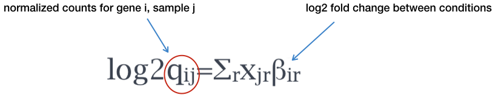
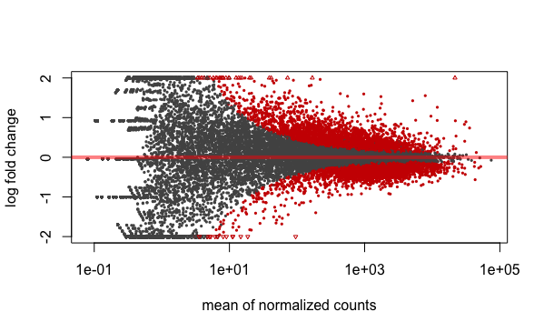
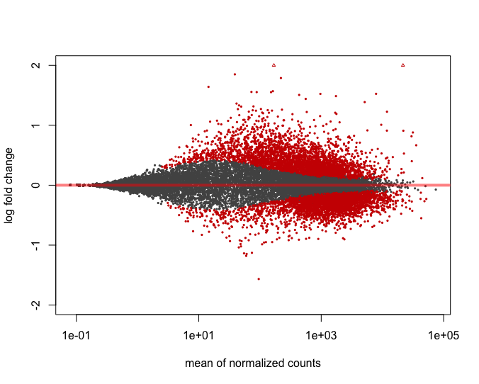

# Model and hypothesis testing

## Generalized Linear Model fit for each gene

The final step in the DESeq2 workflow is fitting the **Negative Binomial (NB) model** for each gene and performing differential expression testing.

{ width=400 }
**Modeling RNA-Seq Counts**
DESeq2 fits a **negative binomial generalized linear model (GLM)** to model RNA-Seq counts for each gene. A GLM is a flexible statistical method that models relationships between variables, similar to linear regression, but it can handle non-normally distributed data like binary or count data.

For DESeq2, the two key parameters required to fit the negative binomial GLM are the **size factor** and the **dispersion estimate**. The model also incorporates the design matrix, which specifies experimental conditions and any covariates of interest. By fitting the NB model, DESeq2 estimates the gene’s mean counts and dispersion, then uses either the **Wald test** or **likelihood ratio test (LRT)** to assess whether the observed differences between conditions are statistically significant.

The general form of the negative binomial model is shown below:

{ width=600 }

where $K_{ij}$ are the raw counts for gene \( i \) in sample \( j \).

**Estimating Coefficients Using Maximum Likelihood**
After fitting the negative binomial model, DESeq2 estimates the regression coefficients ($\beta$) for each sample group, along with their standard errors. This is done using maximum likelihood estimation (MLE), which maximizes the log-likelihood function of the NB distribution.

Once the dispersion ($\alpha$) has been estimated, DESeq2 treats it as fixed and focuses on estimating the regression coefficients ($\beta$). These coefficients describe the relationship between the mean expression ($\mu_i$) and the experimental conditions.

The mean ($\mu_{i}$) is modeled as a function of the covariates in the design matrix ($X_i$) and the regression coefficients ($\beta$):

$$log2(\mu_{i}) = X_{i} \beta$$
or equivalently:

$$\mu_{i} = exp{X_{i} \beta}$$

Where:
- $\mu_{i}$ is the expected value of the counts for gene \( i \)
- $\X_{i}$ is the design matrix for gene \( i \), and 
- $\beta$ is the vector of coefficients for gene \( i \)

The log-likelihood for the regression coefficients $\beta$ is maximized by substituting the mean ($\mu_{i}$) with $exp{\X_{i} \beta}$ into the negative binomial likelihood function.

**Log2 Fold Change and Adjustments**
The estimated $\beta$ coefficients represent the **log2 fold changes** between different sample groups. However, log2 fold changes are noisier when gene counts are low due to the higher dispersion seen in low-count genes. To address this, the log2 fold changes calculated by the model are **adjusted** to improve reliability.

{ width=600 }
In the case of our dataset, the design has three levels, and the model can be written as:


$$\LARGE y = \beta_0 + \beta_1 x_{mov10kd} + \beta_2 x_{mov10oe}$$
Where:

* $y$ is the **log2 of the fitted counts** for each gene

* $\beta_0$ is the **log2 average** of the reference group (e.g. “control”)

* $\beta_1$ is the **log2 fold change** between “Mov10_kd” and the reference group “control”

* $\beta_2$ is the **log2 fold change** between “Mov10_oe” and the reference group “control”

* $x_{mov10kd}$ and $x_{mov10oe}$ are indicators of whether a sample belongs to the "Mov10_kd" or "Mov10_oe" groups, respectively.

The $\beta$ coefficients are the estimates for the **log2 fold changes** for each sample group. However, **log2 fold changes** are inherently noisier when counts are low due to the large dispersion we observe with low read counts. To avoid this, the **log2 fold changes calculated by the model need to be adjusted**. 

By adjusting the log2 fold changes for low counts, DESeq2 ensures that the results are more robust and less prone to errors caused by high dispersion.

## Shrunken Log2 Fold Changes (LFC)
**Why Are Shrunken Log2 Fold Changes Used in DESeq2?**
In RNA-Seq analysis, genes with low counts or high variability often have large or erratic log2 fold change (logFC) estimates, even when the actual difference between conditions is small. These highly variable estimates can skew downstream analysis. To address this, DESeq2 applies **shrinkage** to bring extreme log2 fold changes closer to more reasonable values.

**Handling Noisy Estimates:**
Genes with low counts or high dispersion values often have noisier log2 fold changes. Shrinking these estimates toward more moderate values improves accuracy.

**Reducing the Influence of Outliers:**
By shrinking extreme log2 fold changes, DESeq2 reduces the impact of outlier genes that may have very high or low counts due to technical artifacts or random variation.
DESeq2 applies shrinkage to log2 fold change estimates, especially when the information for a gene is low, such as:

- **Low counts**
- **High dispersion values**

Similar to how dispersion shrinkage works, log2 fold change shrinkage uses information from **all genes**. A normal distribution is fitted to the log2 fold change estimates across genes, and this is used as a prior to shrink estimates for genes with high uncertainty or high variability. This "borrowing strength" from the overall distribution stabilizes noisy LFC estimates, pulling them closer to the global average.

Genes with **low counts** or a **small number of replicates** will have their LFC estimates shrunk more. Genes with higher counts and more reliable data will undergo less shrinkage, so the adjustment is minimal for genes with strong evidence of differential expression.

{ width=500 }

*Illustration taken from the [DESeq2 paper](https://genomebiology.biomedcentral.com/articles/10.1186/s13059-014-0550-8).*

In the figure above, both the green and purple genes have the same mean values across two sample groups (C57BL/6J and DBA/2J), but the green gene shows little variation while the purple gene has high variation. The **shrunken log2 fold change** for the green gene (dotted line) is nearly the same as its **unshrunken estimate** (vertex of the green **solid line**). However, the LFC estimates for the purple gene is pulled much closer to the prior distribution (black line) due to its higher dispersion.

**Generating Shrunken LFC Estimates**
To generate shrunken log2 fold change estimates, you can run the `lfcShrink()` function on your results object:

```{r, eval = FALSE}}
shrunken_results <- lfcShrink(dds, contrast = c("condition", "treated", "control"), res = results)
```

## Statistical test for LFC estimates: Wald test
DESeq2 uses the Wald test as the default method for hypothesis testing when comparing two groups. The Wald test evaluates the significance of the log2 fold change for each gene by comparing the LFC estimate to its standard error.

The Wald test is performed as follows:

The log2 fold change is divided by its standard error, yielding a z-statistic.
The z-statistic is compared to a standard normal distribution to compute a p-value.
If the p-value is small enough, the null hypothesis (LFC = 0) is rejected, indicating evidence of differential expression.

**Overall DESeq2 Workflow:**
In DESeq2, the Wald test is the default used for hypothesis testing when comparing two groups. The Wald test is a test usually performed on the LFC estimates.

### Overall DESeq2 workflow:
1. Estimate Size Factors
2. Estimate Dispersions
3. Fit the Negative Binomial GLM
4. Perform Hypothesis Testing

**Creating Contrasts for Hypothesis Testing**
In DESeq2, **contrasts** define the groups you want to compare for differential expression testing. There are two main ways to specify contrasts:

**Use the default comparison:** 
DESeq2 automatically uses the base factor level of the condition of interest, determined alphabetically.

**Specify the contrast manually:** 
You can explicitly define which groups to compare using the contrast argument in the results() function. The last level specified becomes the base for comparison.
	
```{r, eval=FALSE}
	
	# DO NOT RUN!
	contrast <- c("condition", "level_to_compare", "base_level")
	results(dds, contrast = contrast, alpha = alpha_threshold)
	
```
The `alpha` parameter sets the significance cutoff used for optimizing the independent filtering. After testing your genes and getting p-values, DESeq2 performs a step which is called "independent filtering" which removes genes with very low counts or high dispersion that are unlikely to be significant. The default alpha is 0.1, but you can adjust it based on the false discovery rate (FDR) threshold you're using, such as 0.05.

### MOV10 DE Analysis: Contrasts and Wald Tests

In our MOV10 dataset, there are three groups, allowing for the following pairwise comparisons:

1. Control vs. Mov10 overexpression
2. Control vs. Mov10 knockdown
3. Mov10 knockdown vs. Mov10 overexpression

For this analysis, **we are primarily interested in comparisons #1 and #2.** The design formula we provided earlier (~ sampletype) defines our main factor of interest.

**Building the Results Table**
To build the results table, we use the `results()` function. You can specify the `contrast` to be tested using the contrast argument. In this example, we’ll save the unshrunken and shrunken results to different variables. We’ll also set the `alpha` to 0.05, which is the significance cutoff for independent filtering.
```{r}

## Define contrasts, extract results table, and shrink log2 fold changes
contrast_oe <- c("sampletype", "MOV10_overexpression", "control")

res_tableOE_unshrunken <- results(dds, contrast=contrast_oe, alpha = 0.05)

resultsNames(dds)

res_tableOE <- lfcShrink(dds = dds, coef =  "sampletype_MOV10_overexpression_vs_control", res = res_tableOE_unshrunken)
```

**The Importance of Contrast Order in Log2 Fold Change (LFC) Calculations**
The order of the names in the contrast determines the direction of the fold change reported. The second element in the contrast is treated as the baseline or reference level. For example, if you observe a log2 fold change of -2, this indicates that the gene expression is lower in Mov10_oe relative to the control.

**MA Plot**
An MA plot is a useful visualization for exploring differential expression results. It shows the relationship between the mean of the normalized counts (on the x-axis) and the log2 fold changes (on the y-axis) for all genes tested. Genes that are significantly differentially expressed are highlighted in color for easier identification.

This plot is also a great way to illustrate the effect of LFC shrinkage. DESeq2 provides a simple function to generate an MA plot.

**Unshrunken Results:**
```{r}
plotMA(res_tableOE_unshrunken, ylim=c(-2,2))
```

{ width=600 }

**Shrunken results:**
```{r}
plotMA(res_tableOE, ylim=c(-2,2))
```

{ width=600 }

In addition to comparing LFC shrinkage, the MA plot helps you evaluate the magnitude of fold changes and how they are distributed relative to mean expression. You would expect to see significant genes across the full range of expression levels. 

**MOV10 DE Analysis: Exploring the Results**

The results table in `DESeq2` looks similar to a data.frame and can be treated like one for accessing or subsetting data. However, it is stored as a `DESeqResults` object, which is important to keep in mind when working with visualization tools.
```{r}
class(res_tableOE)
```

Let's go through some of the columns in the results table to get a better idea of what we are looking at. To extract information regarding the meaning of each column we can use `mcols()`:

```{r}
mcols(res_tableOE, use.names = T)
```

* `baseMean`: mean of normalized counts for all samples
* `log2FoldChange`: log2 fold change estimate
* `lfcSE`: standard error of the LFC estimate
* `stat`: Wald statistic
* `pvalue`: P-value from the Wald test
* `padj`: Adjusted p-values using the Benjamini-Hochberg method
 
Now let's take a look at what information is stored in the results:
```{r}
head(res_tableOE)
```

```
log2 fold change (MAP): sampletype MOV10_overexpression vs control 
Wald test p-value: sampletype MOV10_overexpression vs control 
DataFrame with 6 rows and 6 columns
               baseMean log2FoldChange      lfcSE       stat    pvalue       padj
              <numeric>      <numeric>  <numeric>  <numeric> <numeric>  <numeric>
1/2-SBSRNA4  45.6520399     0.26976764 0.18775752  1.4367874 0.1507784 0.25242910
A1BG         61.0931017     0.20999700 0.17315013  1.2128030 0.2252051 0.34444163
A1BG-AS1    175.6658069    -0.05197768 0.12366259 -0.4203185 0.6742528 0.77216278
A1CF          0.2376919     0.02237286 0.04577046  0.4888056 0.6249793         NA
A2LD1        89.6179845     0.34598540 0.15901426  2.1758136 0.0295692 0.06725157
A2M           5.8600841    -0.27850841 0.18051805 -1.5428286 0.1228724 0.21489067
```
**Interpreting p-values Set to NA**
In some cases, p-values or adjusted p-values may be set to NA for a gene. This happens in three scenarios:

1. **Zero counts:** If all samples have zero counts for a gene, its baseMean will be zero, and the log2 fold change, p-value, and adjusted p-value will all be set to NA.

2. **Outliers:** If a gene has an extreme count outlier, its p-values will be set to NA. These outliers are detected using Cook’s distance.

3. **Low counts:** If a gene is filtered out by independent filtering for having a low mean normalized count, only the adjusted p-value will be set to NA.

**Multiple Testing Correction**
In the results table, we see both **p-values** and **adjusted p-values.** Which should we use to identify significantly differentially expressed genes?

If we used the `p-value` directly from the Wald test with a significance cut-off of p < 0.05, that means there is a 5% chance it is a false positives. Each p-value is the result of a single test (single gene). The more genes we test, the more we inflate the false positive rate. **This is the known as the multiple testing problem.** For example, testing 20,000 genes with a p-value threshold of 0.05 would result in 1,000 genes being significant by chance alone. If we found 3000 genes to be differentially expressed total, 150 of our genes are false positives. We would not want to sift through our "significant" genes to identify which ones are true positives.

DESeq2 helps reduce the number of genes tested by removing those genes unlikely to be significantly DE prior to testing, such as those with low number of counts and outlier samples (gene-level QC). However, we still need to correct for multiple testing to reduce the number of false positives, and there are a few common approaches:
To address this, we apply **multiple testing correction**.

DESeq2 corrects p-values using the **Benjamini-Hochberg (BH)** method by default, which controls the **false discovery rate (FDR)**. Other methods, like **Bonferroni**, are available but tend to be more conservative and lead to higher rates of false negatives.

In most cases, we should use the **adjusted p-values** (BH-corrected) to identify significant genes.

### MOV10 DE Analysis: Control vs. Knockdown

After examining the overexpression results, let's move on to the comparison between **Control vs. Knockdown**. We’ll use contrasts in the `results()` function to extract the results table and store it in the `res_tableKD` variable.
```{r}

## Define contrasts, extract results table, and shrink log2 fold changes
 c("sampletype", "MOV10_knockdown", "control")

res_tableKD_unshrunken <- results(dds, contrast = contrast_kd, alpha = 0.05)

resultsNames(dds)

# We can also specify contrasts using `coef` argument in `lfcShrink()`
res_tableKD <- lfcShrink(dds, coef = 2, res=res_tableKD_unshrunken)

## Save results for future use
saveRDS(res_tableKD, file = "data/res_tableKD.RDS")

## Save all objects for later
save.image()

```
Take a quick look at the results table for the Control vs. Knockdown comparison to ensure the format is similar to what we saw with the overexpression analysis.

### MOV10 DE Analysis: Control versus Knockdown

Let’s take a quick look at the results table from the Wald test for the Control-Knockdown comparison to ensure the format is similar to what we observed with the overexpression (OE) analysis.

## Summarizing Results
To summarize the results, DESeq2 offers the `summary()` function, which conveniently reports the number of genes that are significantly differentially expressed at a specified threshold (`default FDR < 0.05`). Note that, even though the output refers to p-values, it actually summarizes the results using **adjusted p-values (padj/FDR)**.

Let’s start by summarizing the results for the OE vs. control comparison:
```{r}
## Summarize results
summary(res_tableOE)
```

In addition to reporting the number of up- and down-regulated genes at the default significance threshold, this function also provides information on:

- **Number of genes tested** (genes with non-zero total read count)
- **Number of genes excluded** from multiple test correction due to low mean counts

### Extracting Significant Differentially Expressed Genes

In some cases, using only the FDR threshold doesn’t sufficiently reduce the number of significant genes, making it difficult to extract biologically meaningful results. To increase stringency, we can apply an additional fold change threshold.

Although the summary() function doesn't include an argument for fold change thresholds, we can define our own criteria.

Let’s start by setting the thresholds for both adjusted p-value (FDR < 0.05) and log2 fold change (|log2FC| > 0.58, corresponding to a 1.5-fold change):

```{r}
### Set thresholds
padj.cutoff <- 0.05
lfc.cutoff <- 0.58
```

Next, we’ll convert the results table to a tibble for easier subsetting:

```{r}
res_tableOE_tb <- res_tableOE %>%
  data.frame() %>%
  rownames_to_column(var = "gene") %>% 
  as_tibble()
```

Now, we can filter the table to retain only the genes that meet the significance and fold change criteria:

```{r}

sigOE <- res_tableOE_tb %>%
        filter(padj < padj.cutoff & abs(log2FoldChange) > lfc.cutoff)

# Save the results for future use
saveRDS(sigOE,"data/sigOE.RDS")

```

**Exercise** points = +3

How many genes are differentially expressed in the **Overexpression vs. Control** comparison based on the criteria we just defined? Does this reduce the number of significant genes compared to using only the FDR threshold?

```{r}
# Your code here
```

```{r, results = "asis", echo = FALSE}

solutions( 'nrow(sigOE)')

```
  
**Does this reduce our results?** 

```{r}
# Your code here
```

```{r, results = "asis", echo = FALSE}

solutions( 'nrow(sigOE)\n
            nrow(res_tableOE)\n
            100 - (nrow(sigOE)/nrow(res_tableOE) *100)\n
            "Yes, it is decreased from 23368 to 951 
            (representing about 4% of the genes)."')
```
 
### MOV10 Knockdown Analysis: Control vs. Knockdown

Next, let’s perform the same analysis for the Knockdown vs. Control comparison. We’ll use the same thresholds for adjusted p-value (FDR < 0.05) and log2 fold change (|log2FC| > 0.58).
```{r}

res_tableKD_tb <- res_tableKD %>%
  data.frame() %>%
  rownames_to_column(var = "gene") %>%
  as_tibble()

sigKD <- res_tableKD_tb %>%
         dplyr::filter(padj < padj.cutoff & 
         abs(log2FoldChange) > lfc.cutoff)

# We'll save this object for use in the homework
saveRDS(sigKD,"data/sigKD.RDS")
```

**How many genes are differentially expressed in the Knockdown compared to Control?**

```{r}
# Your code here
```

```{r, results = "asis", echo = FALSE}
solutions('nrow(sigKD)')
```
 
Now that we have subsetted our data, we are ready for visualization!

***
