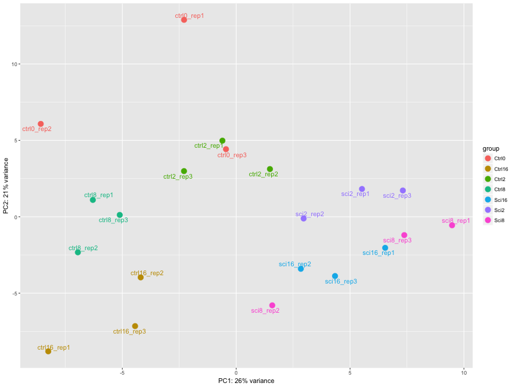
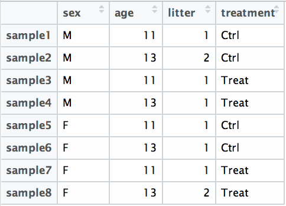
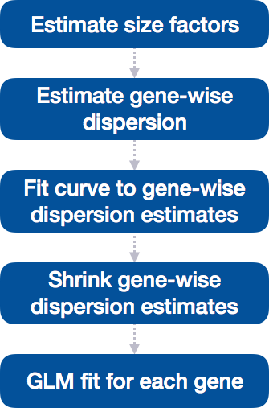
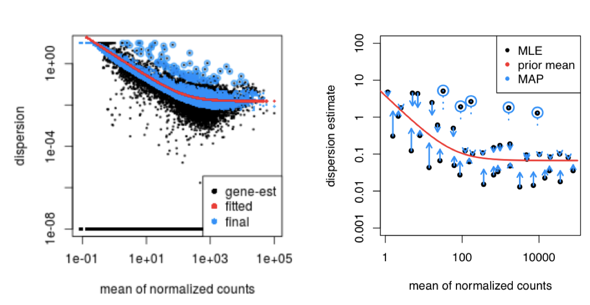
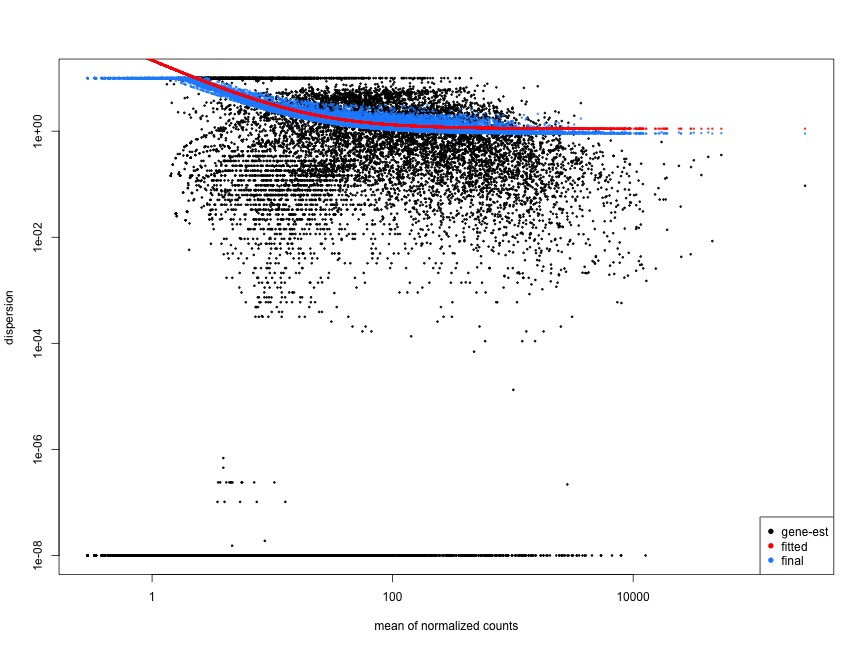

# Codebook answers
30 total points


```{r, include = FALSE}
knitr::opts_chunk$set(echo = TRUE)
```
## DGE analysis overview

**.md file = 01-DGE_setup_and_overview.md**

### Setting up

#### Loading libraries
```{r, message = FALSE}

library(tidyverse)
library(RColorBrewer)
library(DESeq2)
library(pheatmap)
library(ggplot2)
library(ggrepel)

```

#### Loading data
```{r}

data <- read.delim("data/Mov10_full_counts.txt", row.names = 1)

meta <- read.delim("data/Mov10_full_meta.txt", row.names = 1)
```

Use class() to inspect our data and make sure we are working with data frames:
```{r}
### Check classes of the data we just brought in
class(meta)
class(data)
```

#### Viewing data

```{r}

rownames(meta)

names(data)

```
You’ll notice the colnames of the data are the sample names, and the rownames of the metadata are the sample names. This is important as we will be merging the metadata with the data based on the sample names.

### DGE analysis workflow

#### RNA-seq count distribution

To determine the appropriate statistical model, we need information about the distribution of counts. To get an idea about how RNA-seq counts are distributed, let’s plot the counts for a single sample, ‘Mov10_oe_1’:
```{r}
ggplot(data) +
geom_histogram(aes(x = Mov10_oe_1), stat = "bin", bins = 200) +
  xlab("Raw expression counts") +
  ylab("Number of genes")
```

If we zoom in close to zero, we can see a large number of genes with counts of zero:
```{r}
ggplot(data) +
geom_histogram(aes(x = Mov10_oe_1), stat = "bin", bins = 200) +
   xlim(-5, 500)  +
   xlab("Raw expression counts") +
   ylab("Number of genes")
```

These images illustrate some common features of RNA-seq count data, including a low number of counts associated with a large proportion of genes, and a long right tail due to the lack of any upper limit for expression.

#### Modeling count data

By plotting the *mean versus the variance* of our data we should be able to see that the variance > mean and therefore it does not fit the Poisson distribution and is better suited to the Negative Binomial (NB) model.

To calculate the mean and variance of our data, we will use the `apply` function. The `apply` function allows you to apply a function to the margins (rows or columns) of a matrix. The syntax for `apply` is as follows: `apply(X, MARGIN, FUN)`, where `X` is a matrix, `MARGIN` is the margin of the matrix to apply the function to (1 = rows, 2 = columns), and `FUN` is the function to apply. 

We will use `MARGIN = 1` to apply the mean and variance of the counts for each row (gene) across the 'Mov10 overexpression' replicates. We will then create a data frame with the mean and variance of the counts for each gene.
```{r}

mean_counts <- apply(data[, 3:5], 1, mean)

variance_counts <- apply(data[, 3:5], 1, var)

# for ggplot we need the data to be in a data.frame
df <- data.frame(mean_counts, variance_counts)
```

Run the following code to plot the *mean versus variance* for the 'Mov10 overexpression' replicates:
```{r}

ggplot(df) +
  geom_point(aes(x = mean_counts, y = variance_counts)) +
  geom_line(aes(x = mean_counts, y = mean_counts, color = "red")) +
  scale_y_log10() +
  scale_x_log10()
```

Note that in the above figure, the variance across replicates tends to be greater than the mean (slope > 1, red line), especially for genes with large mean expression levels. This is a good indication that our data do not fit the Poisson distribution and we need to account for this increase in variance using the Negative Binomial model.

## Count normalization

**.md file = 02-DGE_count_normalization.md**


### Normalization

The steps for DESeq2 median of ratios method:

1. **calculate the geometric mean of each row in the count matrix**

2. **divide each row by the row's geometric mean**

3. **take the median value for each column -- these are your size factors, one for each sample**

4. **divide each sample by its size factor**

**Normalized Counts**

**Exercise** (in class)

Manually compute the size factors for our count matrix, then normalize the matrix.

Formula for geometric mean: multiply all values in a vector and take the nth root of the product
```{r}
# Geometric mean function: 
geomean <- function(x, na.rm = TRUE){
    geo <- prod(x, na.rm = na.rm)^(1/length(x))
    
}

# OR the equivalent

geomean <- function(x, na.rm = TRUE){

    geo = exp(log(prod(x)^(1/length(x))))
    # which is the same as:
    geo = exp((1/length(x))*sum(log(x)))
    # which is the same as:

    geo = exp(mean(log(x), na.rm = na.rm))
    geo
}


```

Hint: use the `apply` function.

1. Calculate the geometric mean for each row in the count matrix
```{r}

geo <- apply(as.matrix(data),1,geomean)
```

2. Calculates ratio of each sample to the reference

Divide each row by the row's geometric mean:
```{r}

div <- apply(data,2,"/",geo)

```

3. Calculate the normalization factor for each sample (size factor)

Take the median value for each column -- these are your size factors, one for each sample, you need to remove the `NA` values before calculating the median:
```{r}

sf <- apply(div, 2, function(x){m = median(x[is.finite(x)])})

```

4. Calculate the normalized count values using the normalization factor

Divide each sample by its size factor.

This is performed by dividing each raw count value in a given sample by that sample’s normalization factor to generate normalized count values. This is the final step in the normalization process.

Sweep is a function that allows you to apply a function to a margin of an array. In this case, we are dividing each column by the size factor for that column. The `sweep` function takes the array, the margin to apply the function to (2 = columns), the size factor, and the function to apply (`/`).
```{r}

norm <- sweep(data, 2, sf, FUN = "/")

```

**Normalized Counts**

**Exercise** points = +1

Determine the normalized counts for your gene of interest, PD1, given the raw counts and size factors below.

NOTE: You will need to run the code below to generate the raw counts dataframe (PD1) and the size factor vector (size_factors), then use these objects to determine the normalized counts values:


```{r}
# Raw counts for PD1
PD1 <- c(21, 58, 17, 97, 83, 10)
names(PD1) <- paste0("Sample", 1:6)
PD1 <- data.frame(PD1)
PD1 <- t(PD1)

# Size factors for each sample
size_factors <- c(1.32, 0.70, 1.04, 1.27, 1.11, 0.85)
```

Normalized counts:
```{r}

# Your code here

```

### Count normalization of Mov10 dataset

#### 1. Match the metadata and counts data
```{r}
### Check that sample names match in both files
all(colnames(data) %in% rownames(meta))
all(colnames(data) == rownames(meta))
```

The colnames of our data don't match the rownames of our metadata so we need to reorder them. We can use the `match` function:
```{r}

idx <- match(rownames(meta),colnames(data))
data <- data[,idx]

all(colnames(data) == rownames(meta))
```

**Exercise** points = +2

Suppose we had sample names matching in the counts matrix and metadata file, but they were out of order. Write the line(s) of code required to create a new matrix with columns ordered such that they were identical to the row names of the metadata. Check that the column names of the new matrix match the row names of the metadata.
```{r, eval = FALSE}
# Write the code to reorder the columns of the data matrix to match the row names of the metadata
# Your code here

```

```{r}

# Check that sample names match in both files
 
# Your code here

```

#### 2. Create DESEq2 object
```{r}

dds <- DESeqDataSetFromMatrix(countData = data, colData = meta, design = ~ sampletype)

```

You can use DESeq-specific functions to access the different slots and retrieve information, if you wish. For example, suppose we wanted the original count matrix we would use counts():
```{r}

head(counts(dds[,1:5]))

colData(dds)

design(dds)

levels(colData(dds)$sampletype)

```

As we go through the workflow we will use the relevant functions to check what information gets stored inside our object. We can also run:
```{r}
slotNames(dds)
```

#### 3. Generate the Mov10 normalized counts

To perform the **median of ratios method** of normalization, DESeq2 has a single `estimateSizeFactors()` function that will generate size factors for us. We will use the function in the example below, but **in a typical RNA-seq analysis this step is automatically performed by the `DESeq()` function**, which we will see later.
```{r}
dds <- estimateSizeFactors(dds)
```

By assigning the results back to the dds object we are filling in the slots of the DESeqDataSet object with the appropriate information. We can take a look at the normalization factor applied to each sample using:
```{r}
sizeFactors(dds)
```

Now, to retrieve the normalized counts matrix from dds, we use the counts() function and add the argument normalized = TRUE.
```{r}
normalized_counts <- counts(dds, normalized = TRUE)
```

We can save this normalized data matrix to file for later use:
```{r}
write.table(normalized_counts, file = "data/normalized_counts.txt", sep = "\t")

```

## DGE QC analysis

**.md file = 03-DGE_QC_analysis.md**

#### Principal components analysis (PCA)

Principal Component Analysis (PCA) is a technique used to emphasize variation and bring out strong patterns in a dataset (dimensionality reduction). The take home message for our purposes is that **if two samples have similar levels of expression for the genes that contribute significantly to the variation represented by PC1, they will be plotted close together on the PC1 axis.** Therefore, we would expect that biological replicates to have similar scores (since the same genes are changing) and cluster together on PC1 and/or PC2, and the samples from different treatment groups to have different score. This is easiest to understand by visualizing example PCA plots.

**Exercise** points = +7

The figure below was generated from a time course experiment with sample groups ‘Ctrl’ and ‘Sci’ and the following timepoints: 0h, 2h, 8h, and 16h.

{ width=600 }

**Determine the sources explaining the variation represented by PC1 and PC2.** points = +1

- Ans: 

**Do the sample groups separate well?** points = +1

- Ans: 

**Do the replicates cluster together for each sample group?** points = +1

- Ans: 

**Are there any outliers in the data?** points = +1

- Ans: 

**Should we have any other concerns regarding the samples in the dataset?** points = +1

- Ans: 


To improve the distances/clustering for the PCA and heirarchical clustering visualization methods, we need to moderate the variance across the mean by applying the rlog transformation to the normalized counts.

The rlog transformation of the normalized counts is only necessary for these visualization methods during this quality assessment. We will not be using these tranformed counts downstream:
```{r}
### Transform counts for data visualization
rld <- rlog(dds, blind = TRUE)
```

We use this object to plot the PCA and heirarchical clustering figures for quality assessment.

```{r}
### Plot PCA
plotPCA(rld, intgroup = "sampletype")
```
**Exercise** points = +2


**What does this plot tell you about the similarity of samples?** points = +1

- Ans: 

**Does it fit the expectation from the experimental design?** points = +1

- Ans:

By default the function uses the top 500 most variable genes. You can change this by adding the `ntop` argument and specifying how many genes you want to use to draw the plot.

#### Hierarchical Clustering


We will be using the `pheatmap()` function from the pheatmap package for heatmaps. This function requires a matrix/dataframe of numeric values as input, and so the first thing we need to is retrieve that information from the rld object:
```{r}

### let's look at the structure of rld.
class(rld)
slotNames(rld)
### we can extract the rlog matrix from the object using the `assay` function:
###
rld_mat <- assay(rld)

```

Then we need to compute the pairwise correlation values for samples. We can do this using the `cor()` function:
```{r}
### Compute pairwise correlation values
rld_cor <- cor(rld_mat)    ## cor() is a base R function

head(rld_cor[,1:5])   ## check the output of cor(), make note of the rownames and colnames

min(rld_cor) ## we can see our samples are highly correlated
```

And now to plot the correlation values as a heatmap:
```{r}
### Plot heatmap
pheatmap(rld_cor)
```

**Exercise** points = +3

The pheatmap function has a number of different arguments that we can alter from default values to enhance the aesthetics of the plot. Try adding the arguments `color`, `border_color`, `fontsize_row`, `fontsize_col`, `show_rownames` and `show_colnames` How does your plot change? Take a look through the help pages (?pheatmap) and identify what each of the added arguments is contributing to the plot.
```{r}
display.brewer.all()

# Use heat.colors for the color palette
heat.colors <- brewer.pal(9, "Blues")

# Your code here

```

- Ans: 

## DGE analysis workflow

**.md file = 04_DGE_DESeq2_analysis.md**

### Running DESeq2

### Set the Design Formula

The main purpose of the **design formula** in DESeq2 is to specify the factors that are influencing gene expression so that their effects can be **accounted for** or **controlled** during the analysis. This allows DESeq2 to isolate the effect of the variable you're primarily interested in while adjusting for other known sources of variation. The design formula should have all of the factors in your metadata that account for major sources of variation in your data. The last factor entered in the formula should be the condition of interest.

The design formula allows you to include multiple variables that might affect gene expression, so that DESeq2 can:

- **Adjust for known sources of variation** (e.g., **batch effects**, **sex**, **age**, etc.)

- **Test the factor of interest** (e.g., **treatment**) after adjusting for these confounders.

For example, let's look at the design formula for our count matrix:
```{r}
design(dds)
```

**Example**
Suppose you have metadata that includes **sex**, **age**, and **treatment** as shown below:

{ width=300 }

If you want to examine differences in gene expression between **treatment** conditions, and you know that **sex** and **age** are major sources of variation, your design formula would look like this:

`design <- ~ sex + age + treatment`

The design formula is specified using the tilde (~) symbol in R, with the factors of interest separated by plus (+) signs. The formula structure tells DESeq2 which known sources of variation to control for during the analysis, as well as the factor of interest to test for differential expression. 

**Exercise** points = +3

1. Suppose you wanted to study the expression differences between the two age groups in the metadata shown above, and major sources of variation were `sex` and `treatment`, how would the design formula be written?
points = +1
```{r, eval = FALSE}

# the default behavior of `results` is to return the comparison of the last group in the design formula, so your condition of interest should come last:


```

2. Based on our Mov10 metadata dataframe, which factors could we include in our design formula? points = +1

- Ans: 

3. What would you do if you wanted to include a factor in your design formula that is not in your metadata? points = +1

- Ans: 


### MOV10 Differential Expression Analysis

Now that we understand how to specify the model in DESeq2, we can proceed with running the differential expression pipeline on the raw count data.

**Running Differential Expression in Two Lines of Code**

To obtain differential expression results from our raw count data, we only need to run two lines of code!

First, we create a DESeqDataSet, as we did in the ['Count normalization'](https://hbctraining.github.io/DGE_workshop/lessons/02_DGE_count_normalization.html#2-create-deseq2-object) lesson, specifying the location of our raw counts and metadata, and applying our design formula:

```{r}
## Create DESeq object
dds <- DESeqDataSetFromMatrix(countData = data, colData = meta, design = ~ sampletype)
```

Next, we run the actual differential expression analysis with a single call to the `DESeq()` function. This function handles everything—from **normalization** to **linear** modeling—all in one step. During execution, `DESeq2` will print messages detailing the steps being performed: estimating size factors, estimating dispersions, gene-wise dispersion estimates, modeling the mean-dispersion relationship, and statistical testing for differential expression.

```{r}
## Run analysis
dds <- DESeq(dds)
```

By re-assigning the result to back to the same variable name (`dds`), we update our `DESeqDataSet` object, which will now contain the results of each step in the analysis, effectively filling in the `slots` of our `DESeqDataSet` object.

### DESeq2 differential gene expression analysis workflow

Everything from normalization to linear modeling was carried out by the use of a single function!

With the 2 lines of code above, we just completed the workflow for the differential gene expression analysis with DESeq2. The steps in the analysis are output below:

{ width=200 }

#### Step 1: Estimate size factors

MOV10 DE analysis: examining the size factors
```{r}
## Check the size factors
sizeFactors(dds)
```

Take a look at the total number of reads for each sample:
```{r}
## Total number of raw counts per sample
colSums(counts(dds, normalized = FALSE))
```

**How do the numbers correlate with the size factor?**

```{r}
cor(colSums(counts(dds, normalized = FALSE)),sizeFactors(dds))
```

- Ans: they are highly correlated

### Step 2: Estimate gene-wise dispersion

{ width=200 }

The next step in differential expression analysis is estimating gene-wise dispersions. Before diving into the details of how DESeq2 estimates these values, it’s important to understand what dispersion means in the context of RNA-Seq analysis.

**What is Dispersion?**

Dispersion measures the variability in gene expression that cannot be explained by differences in the mean expression level alone. It captures the extra-Poisson variability observed in RNA-Seq data, where the variance tends to exceed the mean due to both biological and technical factors.

Dispersion in DESeq2 reflects the variability in gene expression for a given mean count and is inversely related to the mean and directly related to the variance:

- Genes with lower mean counts tend to have higher dispersion (more variability).

- Genes with higher mean counts tend to have lower dispersion (less variability).

The plot below shows the relationship between mean and variance in gene expression. Each black dot represents a gene. Notice that for genes with higher mean counts, the variance can be predicted more reliably, whereas genes with lower mean counts exhibit more variability, leading to more spread in their dispersion estimates.

{ width=600 }

**How DESeq2 Models Dispersion Using the Negative Binomial Distribution**

DESeq2 models RNA-Seq count data using the negative binomial (NB) distribution, which effectively handles overdispersion -— a common feature of biological data where the variance exceeds the mean. The two primary parameters of the NB model are the mean expression level and the dispersion, which respectively capture the expected gene counts and the variability across replicates.

For each gene \( i \), the observed count $Y_{ij}$ in sample \( j \)  is modeled as:

$$
Y_{ij} \sim \text{NB}\left(\mu_{ij}, \alpha_{i}\right)
$$

Where:

- \( Y_{ij}\) is the observed count for gene \( i \) in sample \( j \)

- \( \mu_{ij}\) is the expected normalized count for gene \( i \) in sample \( j \). 

- \( \alpha_{i}\) is the gene-specific dispersion parameter for gene \( i \).
  
**How Does Dispersion Relate to the Model?**

In DESeq2, dispersion ($\alpha_{i}$) captures the variability in counts beyond what is expected based on the mean. It helps model the biological variability between replicates within the same experimental condition. However, with small sample sizes (e.g., 3-6 replicates per group), gene-specific estimates of dispersion can be unreliable, particularly for genes with similar mean counts but differing variances.

To improve accuracy, DESeq2 shares information across genes with similar expression levels through a process called **shrinkage**, assuming that genes with similar mean expression tend to have similar dispersion.

**Variance Formula and Its Importance**

In the negative binomial model used by DESeq2, the variance for each gene \( i \) in sample \( j \) is given by:

$$Var(Y_{ij})  = {\mu_{ij} + \alpha_{i}}{\mu_{ij}^2}$$
Where:

- \( Var(Y_{ij}\) is the variance for gene \( i \) in sample \( j \).

- \( \mu_{ij}\) is the expected normalized count for gene \( i \) in sample \( j \).

- \( \alpha_{i}\) is the gene-specific dispersion parameter.


**Estimating the dispersion for each gene separately:**

DESeq2 uses the negative binomial (NB) distribution to model count data in RNA-Seq experiments. The NB distribution accounts for the overdispersion commonly observed in real biological data, where the variance exceeds the mean. The two key parameters of the NB distribution are the mean expression level and the dispersion.

The first step in estimating dispersion is to obtain dispersion estimates for each gene. The dispersion parameter for each gene is estimated through maximum likelihood estimation (MLE). This method seeks to find the value of $\alpha_{i}$ that maximizes the likelihood of observing the counts $Y_{ij}$, given the model. In other words, MLE identifies the $\alpha_{i}$ that best explains the observed variability for gene $i$.

{ width=200 }

**Visual representation of the global dispersion trend:**

The red line in the plot below shows the global trend, which represents the expected dispersion value for genes of a given expression level. Each black dot corresponds to a gene, plotted with its mean expression and initial dispersion estimate from maximum likelihood estimation (Step 2).

{ width=400 }


{ width=200 }

### Step 4: Shrinking Gene-Wise Dispersion Estimates Toward the Global Trend

After fitting the global trend, DESeq2 applies empirical Bayes shrinkage to the individual gene-wise dispersion estimates, pulling them toward the curve. Empirical Bayes shrinkage is a statistical technique used to stabilize parameter estimates by borrowing information across the entire dataset. This process helps reduce the noise in the estimates, particularly for genes with low counts.

- **Low-count genes** with more uncertain dispersion estimates are pulled closer to the global trend. 

- **Genes with higher counts** or more reliable estimates will be shrunk less.

**Why is shrinkage important?**

Shrinkage improves the **reliability of dispersion estimates** by making them more stable, especially for genes with **low or moderate counts**, where the estimates are typically noisier. This ensures that dispersion estimates are not overly influenced by random fluctuations and are more accurate for downstream differential expression testing.

Shrinkage is crucial for **reducing false positives** in differential expression analysis. Genes with low or moderate dispersion estimates are pulled up toward the curve, making the estimates more reliable for subsequent model fitting and differential expression testing.

Genes with **extremely high dispersion values** (potential outliers) and values above the global trend have more variability than expected for their level of mean expression. These genes are often biological outliers (e.g., genes involved in highly dynamic processes) or technical outliers (e.g., affected by sequencing or sample quality issues) and are typically not shrunk. These outlier genes are highlighted by blue circles in the plot below:

By shrinking the estimates toward the fitted curve, DESeq2 ensures that the final dispersion estimates are more stable and accurate for differential expression testing.


{ width=200 }

{ width=600 }

**Assessing Model Fit with Dispersion Plots**

After shrinkage, it’s important to assess how well the model fits the data. The dispersion plot shows gene-wise dispersions relative to the global trend. Ideally, most genes should scatter around the curve, with dispersions decreasing as mean expression increases.

If you notice unusual patterns, such as a cloud of points far from the curve, this could indicate data quality issues (e.g., outliers, contamination, or problematic samples). Using DESeq2's `plotDispEsts()` function helps visualize the fit of the model and the extent of shrinkage across genes.

**Examples of Problematic Dispersion Plots:**

Below are examples of worrisome dispersion plots that suggest potential issues with data quality or fit:

{ width=600 }

{ width=600 }

### MOV10 Differential Expression Analysis: Exploring Dispersion Estimates

Now, let's explore the dispersion estimates for the MOV10 dataset:

```{r}
## Plot dispersion estimates
plotDispEsts(dds)
```

**Since we have a small sample size, for many genes we see quite a bit of shrinkage. 

**Exercise** points = +1

**Do you think our data are a good fit for the model?**

- Ans: 

## Model fitting

**.md file = 05_DGE_DESeq2_analysis2**

### Generalized Linear Model fit for each gene
 

**Creating Contrasts for Hypothesis Testing**

In DESeq2, **contrasts** define the specific groups to compare for differential expression testing. There are two ways to create contrasts:

**Default Comparison:**

DESeq2 automatically uses the base level of the factor of interest, determined alphabetically, as the **baseline for comparisons (reference)**.

**Manual Specification:**

You can manually specify the contrast using the `contrast` argument in the `results()` function. **The last group in the contrast becomes the base for comparison (reference).**

	
```{r, eval = FALSE}
	
	# DO NOT RUN!
	contrast <- c("condition", "level_to_compare", "base_level")
	results(dds, contrast = contrast, alpha = alpha_threshold)
	
```

The `alpha` parameter in DESeq2 sets the significance cutoff used for optimizing independent filtering. The `alpha` value is used to determine the criteria for independent filtering, meaning DESeq2 will try to optimize the filtering process to maximize the number of genes with adjusted p-values below the `alpha` threshold.
The filtering step removes genes that are unlikely to achieve an adjusted p-value (FDR) below this `alpha` value (i.e., those with low counts or low statistical power). However, the primary criterion used for independent filtering is the mean normalized count of the genes.

By default, `alpha` is set to 0.1, meaning that genes with an adjusted p-value (false discovery rate, or FDR) below this threshold will be considered significant. However, you can adjust the `alpha`  parameter to reflect a more stringent FDR threshold, such as 0.05, depending on your analysis needs.

### MOV10 DE Analysis: Contrasts and Wald Tests

In our MOV10 dataset, there are three groups, allowing for the following pairwise comparisons:

1. **Control vs. Mov10 overexpression**
2. **Control vs. Mov10 knockdown**
3. Mov10 knockdown vs. Mov10 overexpression

For this analysis, **we are primarily interested in comparisons #1 and #2.** The design formula we provided earlier (~ sampletype) defines our main factor of interest.

**Building the Results Table**

To build the results table, we use the `results()` function. You can specify the `contrast` to be tested using the contrast argument. In this example, we’ll save the unshrunken and shrunken results of **Control vs. Mov10 overexpression** to different variables. We’ll also set the `alpha` to 0.05, which is the significance cutoff for independent filtering.
```{r}

## Define contrasts, extract results table, and shrink log2 fold changes
contrast_oe <- c("sampletype", "MOV10_overexpression", "control")

res_tableOE_unshrunken <- results(dds, contrast=contrast_oe, alpha = 0.05)

resultsNames(dds)

res_tableOE <- lfcShrink(dds = dds, coef =  "sampletype_MOV10_overexpression_vs_control", res = res_tableOE_unshrunken)
```

**The Importance of Contrast Order in Log2 Fold Change (LFC) Calculations**

In DESeq2, when you specify a contrast, you are defining a comparison between two levels of a factor (in this case, the "sampletype" factor). The order of the names in the contrast determines the direction of the fold change reported. The first group listed in the contrast ("MOV10_overexpression") is the group you are comparing. The second group listed in the contrast ("control") is the baseline or reference group, against which the comparison is made. A positive log2 fold change means that gene expression is higher in the "MOV10_overexpression" group compared to "control". A negative log2 fold change means that gene expression is lower in the "MOV10_overexpression" group compared to "control".

**MA Plot**

An MA plot is a useful visualization for exploring differential expression results. It shows the relationship between the mean of the normalized counts (on the x-axis) and the log2 fold changes (on the y-axis) for all genes tested. Genes that are significantly differentially expressed are highlighted in color for easier identification.

This plot is also a great way to illustrate the effect of LFC shrinkage. DESeq2 provides a simple function to generate an MA plot.

**Unshrunken Results:**
```{r}
plotMA(res_tableOE_unshrunken, ylim=c(-2,2))
```


**Shrunken results:**
```{r}
plotMA(res_tableOE, ylim=c(-2,2))
```

In addition to comparing LFC shrinkage, the MA plot helps you evaluate the magnitude of fold changes and how they are distributed relative to mean expression. You would expect to see significant genes across the full range of expression levels. 

**MOV10 DE Analysis: Exploring the Results**

The results table in `DESeq2` looks similar to a data.frame and can be treated like one for accessing or subsetting data. However, it is stored as a `DESeqResults` object, which is important to keep in mind when working with visualization tools.
```{r}
class(res_tableOE)
```

Let's go through some of the columns in the results table to get a better idea of what we are looking at. To extract information regarding the meaning of each column we can use `mcols()`:

```{r}
mcols(res_tableOE, use.names = T)
```

* `baseMean`: mean of normalized counts for all samples
* `log2FoldChange`: log2 fold change estimate
* `lfcSE`: standard error of the LFC estimate
* `stat`: Wald statistic
* `pvalue`: P-value from the Wald test
* `padj`: Adjusted p-values using the Benjamini-Hochberg method
 
Now let's take a look at what information is stored in the results:
```{r}
head(res_tableOE)
```

**Interpreting p-values Set to NA**

In some cases, p-values or adjusted p-values may be set to NA for a gene. This happens in three scenarios:

1. **Zero counts:** If all samples have zero counts for a gene, its baseMean will be zero, and the log2 fold change, p-value, and adjusted p-value will all be set to NA.

2. **Outliers:** If a gene has an extreme count outlier, its p-values will be set to NA. These outliers are detected using Cook’s distance.

3. **Low counts:** If a gene is filtered out by independent filtering for having a low mean normalized count, only the adjusted p-value will be set to NA.

**Multiple Testing Correction**

In the results table, we see both **p-values** and **adjusted p-values.** Which should we use to identify significantly differentially expressed genes?

If we used the `p-value` directly from the Wald test with a significance cut-off of p < 0.05, that means there is a 5% chance it is a false positives. Each p-value is the result of a single test (single gene). The more genes we test, the more we inflate the false positive rate. **This is the known as the multiple testing problem.** For example, testing 20,000 genes with a p-value threshold of 0.05 would result in 1,000 genes being significant by chance alone. If we found 3000 genes to be differentially expressed total, 150 of our genes are false positives. We would not want to sift through our "significant" genes to identify which ones are true positives.

DESeq2 helps reduce the number of genes tested by removing those genes unlikely to be significantly DE prior to testing, such as those with low number of counts and outlier samples (gene-level QC). However, we still need to correct for multiple testing to reduce the number of false positives, and there are a few common approaches:

DESeq2 corrects p-values using the **Benjamini-Hochberg (BH)** method by default, which controls the **false discovery rate (FDR)**. 

Step-by-Step Process:

1. Sort the p-values from smallest to largest.

2. Assign ranks to each p-value ($p_{i}$) based on their order in the sorted list, (the smallest p-value gets rank 1, the second smallest gets rank 2, and so on).

3. Compute the **BH-adjusted p-value** using the formula:

$$p_{i}^{adj} = p_{i} \times \frac{m}{i}$$

Where:

- \( p_{i}\) is the raw p-value for hypothesis \( i \)

- \( m\) is the total number of hypotheses (e.g., the total number of genes tested),

- \( i\) is the rank of the p-value.

4. The BH procedure sets a threshold for significance based on the desired FDR level (e.g., 0.05), and the adjusted p-values \( p_{i}^{adj}\) are compared to this threshold.

Other methods, like **Bonferroni**, are available but tend to be more conservative and lead to higher rates of false negatives.

In most cases, we should use the **adjusted p-values** (BH-corrected) to identify significant genes.

### MOV10 DE Analysis: **Control vs. Knockdown**

After examining the overexpression results, let's move on to the comparison between **Control vs. Knockdown**. We’ll use contrasts in the `results()` function to extract the results table and store it in the `res_tableKD` variable.
```{r}

## Define contrasts, extract results table, and shrink log2 fold changes
contrast_kd <-  c("sampletype", "MOV10_knockdown", "control")

res_tableKD_unshrunken <- results(dds, contrast = contrast_kd, alpha = 0.05)

resultsNames(dds)

# We can also specify contrasts using `coef` argument in `lfcShrink()`
res_tableKD <- lfcShrink(dds, coef = 2, res=res_tableKD_unshrunken)

## Save results for future use
saveRDS(res_tableKD, file = "data/res_tableKD.RDS")

## Save all objects for later
save.image()

```


Let's look at the number of genes below the standard p-adjusted value 0.05:
```{r}

table(res_tableKD$padj < 0.05)

table(res_tableOE$padj < 0.05)
```

### MOV10 DE Analysis: **Control versus Knockdown**

Let’s take a quick look at the results table from the Wald test for the **Control-Knockdown** comparison to ensure the format is similar to what we observed with the **overexpression (OE) analysis**.

## Summarizing Results

To summarize the results, DESeq2 offers the `summary()` function, which conveniently reports the number of genes that are significantly differentially expressed at a specified threshold (`default FDR < 0.05`). Note that, even though the output refers to p-values, it actually summarizes the results using **adjusted p-values (padj/FDR)**.

Let’s start by summarizing the results for the OE vs. control comparison:
```{r}
## Summarize results
summary(res_tableOE)
```

In addition to reporting the number of up- and down-regulated genes at the default significance threshold, this function also provides information on:

- **Number of genes tested** (genes with non-zero total read count)
- **Number of genes excluded** from multiple test correction due to low mean counts

### Extracting Significant Differentially Expressed Genes

In some cases, using only the FDR threshold doesn’t sufficiently reduce the number of significant genes, making it difficult to extract biologically meaningful results. To increase stringency, we can apply an additional fold change threshold.

Although the summary() function doesn't include an argument for fold change thresholds, we can define our own criteria.

Let’s start by setting the thresholds for both adjusted p-value (FDR < 0.05) and log2 fold change (|log2FC| > 0.58, corresponding to a 1.5-fold change):

```{r}
### Set thresholds
padj.cutoff <- 0.05
lfc.cutoff <- 0.58
```

Next, we’ll convert the results table to a tibble for easier subsetting:

```{r}
res_tableOE_tb <- res_tableOE %>%
  data.frame() %>%
  rownames_to_column(var = "gene") %>% 
  as_tibble()
```

Now, we can filter the table to retain only the genes that meet the significance and fold change criteria:

```{r}

sigOE <- res_tableOE_tb %>%
        filter(padj < padj.cutoff & abs(log2FoldChange) > lfc.cutoff)

# Save the results for future use
saveRDS(sigOE,"data/sigOE.RDS")

```
### MOV10 DE Analysis: **Control versus Knockdown**

Let’s take a quick look at the results table from the Wald test for the **Control-Knockdown** comparison to ensure the format is similar to what we observed with the **overexpression (OE) analysis**.

## Summarizing Results

To summarize the results, DESeq2 offers the `summary()` function, which conveniently reports the number of genes that are significantly differentially expressed at a specified threshold (`default FDR < 0.05`). Note that, even though the output refers to p-values, it actually summarizes the results using **adjusted p-values (padj/FDR)**.

Let’s start by summarizing the results for the OE vs. control comparison:
```{r}
## Summarize results
summary(res_tableOE)
```

In addition to reporting the number of up- and down-regulated genes at the default significance threshold, this function also provides information on:

- **Number of genes tested** (genes with non-zero total read count)
- **Number of genes excluded** from multiple test correction due to low mean counts

### Extracting Significant Differentially Expressed Genes

In some cases, using only the FDR threshold doesn’t sufficiently reduce the number of significant genes, making it difficult to extract biologically meaningful results. To increase stringency, we can apply an additional fold change threshold.

Although the summary() function doesn't include an argument for fold change thresholds, we can define our own criteria.

Let’s start by setting the thresholds for both adjusted p-value (FDR < 0.05) and log2 fold change (|log2FC| > 0.58, corresponding to a 1.5-fold change):

```{r}
### Set thresholds
padj.cutoff <- 0.05
lfc.cutoff <- 0.58
```

Next, we’ll convert the results table to a tibble for easier subsetting:

```{r}
res_tableOE_tb <- res_tableOE %>%
  data.frame() %>%
  rownames_to_column(var = "gene") %>% 
  as_tibble()
```

Now, we can filter the table to retain only the genes that meet the significance and fold change criteria:

```{r}

sigOE <- res_tableOE_tb %>%
        filter(padj < padj.cutoff & abs(log2FoldChange) > lfc.cutoff)

# Save the results for future use
saveRDS(sigOE,"data/sigOE.RDS")

```

**Exercise** points = +3

**How many genes are differentially expressed in the Overexpression compared to Control, given our criteria specified above? Does this reduce our results?** points = +1
```{r}


```
- Ans: 

**Does this reduce our results?** points = +1
```{r}

```
  -Ans: 

Using the same thresholds as above (`padj.cutoff < 0.05` and `lfc.cutoff = 0.58)`, subset `res_tableKD` to report the number of genes that are up- and down-regulated in Mov10_knockdown compared to control. 
```{r}

res_tableKD_tb <- res_tableKD %>%
  data.frame() %>%
  rownames_to_column(var = "gene") %>%
  as_tibble()

sigKD <- res_tableKD_tb %>%
         dplyr::filter(padj < padj.cutoff & 
         abs(log2FoldChange) > lfc.cutoff)

# We'll save this object for use in the homework
saveRDS(sigKD,"data/sigKD.RDS")
```

**How many genes are differentially expressed in the Knockdown compared to Control?** points = +1
```{r}

```
- Ans: 

## Visualizing rna-seq results

**.md file = 06_DGE_visualizing_results.md**

Let’s start by loading a few libraries (if not already loaded):
```{r}


# load libraries
library(tidyverse)
library(ggplot2)
library(ggrepel)
library(RColorBrewer)
library(DESeq2)
library(pheatmap)
library(dplyr)

# we may want to load our objects again. here:
# load(".RData")
```

When we are working with large amounts of data it can be useful to display that information graphically to gain more insight.

Let’s create tibble objects from the meta and normalized_counts data frames before we start plotting. This will enable us to use the tidyverse functionality more easily.

Basically, we are taking the rownames and adding them as a field in the tibble/data.frame.
```{r}

# Create a tibble for meta data
mov10_meta <- meta %>% 
  rownames_to_column(var = "samplename") %>% 
  as_tibble()
        
# you might need to read in normalized_counts if it is not in your current session:
normalized_counts <-     read.delim("data/normalized_counts.txt", row.names = 1)

# then make sure the colnames of normalized_counts are the same as the mov10_meta$sampname

all(mov10_meta$samplename == colnames(normalized_counts))


# Create a tibble for normalized_counts
normalized_counts <- normalized_counts %>% 
  data.frame() %>%
  rownames_to_column(var = "gene") %>% 
  as_tibble()

```

### Plotting signicant DE genes

One way to visualize results would be to simply plot the expression data for a handful of genes. We could do that by picking out specific genes of interest or selecting a range of genes.

#### Using DESeq2 `plotCounts()` to plot expression of a single gene

To pick out a specific gene of interest to plot, for example Mov10, we can use the `plotCounts()` from DESeq2:
```{r}

# Plot expression for single gene

plotCounts(dds, gene = "MOV10", intgroup = "sampletype") 

# we can give it some color and filled points:

sampletype = as.factor(mov10_meta$sampletype)

library(RColorBrewer)

display.brewer.all()

col = brewer.pal(8,"Dark2")
palette(col)

plotCounts(dds, gene = "MOV10", intgroup = "sampletype",
           col = as.numeric(sampletype),pch = 19) 
```

#### Using ggplot2 to plot expression of a single gene

If you wish to change the appearance of this plot, we can save the output of `plotCounts()` to a variable specifying the `returnData = TRUE` argument, then use `ggplot()`:
```{r}

# Save plotcounts to a data frame object
d <- plotCounts(dds, gene = "MOV10", intgroup = "sampletype", returnData = TRUE)

# Plotting the MOV10 normalized counts, using the samplenames (rownames of d as labels)
ggplot(d, aes(x = sampletype, y = count, color = sampletype)) + 
  geom_point(position = position_jitter(w = 0.1,h = 0)) +
  geom_text_repel(aes(label = rownames(d))) + 
  theme_bw() +
  ggtitle("MOV10") +
  theme(plot.title = element_text(hjust = 0.5))
```

#### Using `ggplot2` to plot multiple genes (e.g. top 20)

Often it is helpful to check the expression of multiple genes of interest at the same time. This often first requires some data wrangling.

We are going to plot the normalized count values for the **top 20 differentially expressed genes (by padj values)**.
```{r}

## Order results by padj values
top20_sigOE_genes <- res_tableOE_tb %>% 
        arrange(padj) %>% 	
#Arrange rows by padj values
        pull(gene) %>% 		
#Extract character vector of ordered genes
        head(n = 20) 		
#Extract the first 20 genes
```

Then, we can extract the normalized count values for these top 20 genes:
```{r}
## normalized counts for top 20 significant genes
top20_sigOE_norm <- normalized_counts %>%
        dplyr::filter(gene %in% top20_sigOE_genes)
```

Now that we have the normalized counts for each of the top 20 genes for all 8 samples, to plot using `ggplot()`, we need to `pivot_longer` top20_sigOE_norm from a wide format to a long format so the counts for all samples will be in a single column to allow us to give ggplot the one column with the values we want it to plot.

The `pivot_longer()` function in the **tidyr** package will perform this operation and will output the normalized counts for all genes for *Mov10_oe_1* listed in the first 20 rows, followed by the normalized counts for *Mov10_oe_2* in the next 20 rows, so on and so forth.

{ width=800 }


```{r}
# Pivoting the columns to have normalized counts to a single column

pivoted_top20_sigOE <- top20_sigOE_norm %>%
  pivot_longer(colnames(top20_sigOE_norm)[2:9], names_to = "samplename", values_to = "normalized_counts")

## check the column header in the "pivoted" data frame
head(pivoted_top20_sigOE)
```

Now, if we want our counts colored by sample group, then we need to combine the metadata information with the melted normalized counts data into the same data frame for input to `ggplot()`. We can do this using the `inner_join()` function from the **dplyr** package. `inner_join()` will merge 2 data frames by the colname in x that matches a column name in y. 

```{r}

pivoted_top20_sigOE <- inner_join(mov10_meta, pivoted_top20_sigOE, by = "samplename")

```

Now that we have a data frame in a format that can be utilised by ggplot easily, let’s plot!
```{r}
## plot using ggplot2
ggplot(pivoted_top20_sigOE) +
        geom_point(aes(x = gene, y = normalized_counts, color = sampletype)) +
        scale_y_log10() +
        xlab("Genes") +
        ylab("log10 Normalized Counts") +
        ggtitle("Top 20 Significant DE Genes") +
        theme_bw() +
      	theme(axis.text.x = element_text(angle = 45, hjust = 1)) +
      	theme(plot.title = element_text(hjust = 0.5))
```

### Heatmap

In addition to plotting subsets, we could also extract the normalized values of *all* the significant genes and plot a heatmap of their expression using `pheatmap()`.
```{r}

sigOE = readRDS("data/sigOE.RDS")
### Extract normalized expression for significant genes from the OE and control samples c(2:4,7:9), and set the gene column (1) to row names

norm_OEsig <- normalized_counts[,c(1,2:4,7:9)] %>% 
              filter(gene %in% sigOE$gene) %>% 
	      data.frame() %>%
	      column_to_rownames(var = "gene") 
```

Now let’s draw the heatmap using pheatmap:
```{r}
### Annotate our heatmap (optional)

annotation <- mov10_meta %>% 
	dplyr::select(samplename, sampletype) %>% 
	data.frame(row.names = "samplename")

### Set a color palette
heat_colors <- brewer.pal(6, "YlOrRd")

### Run pheatmap
pheatmap(norm_OEsig, 
         color = heat_colors, 
         cluster_rows = T, 
         show_rownames = F,
         annotation = annotation, 
         border_color = NA, 
         fontsize = 10, 
         scale = "row", 
         fontsize_row = 10, 
         height = 20)
```

#### Volcano plot

The above plot would be great to look at the expression levels of a good number of genes, but for more of a global view there are other plots we can draw. A commonly used one is a volcano plot; in which you have the log transformed adjusted p-values plotted on the y-axis and log2 fold change values on the x-axis.

To generate a volcano plot (which you have the log transformed adjusted p-values plotted on the y-axis and log2 fold change values on the x-axis), we first need to have a column in our results data indicating whether or not the gene is considered differentially expressed based on p-adjusted values.
```{r}

## Obtain logical vector where TRUE values denote padj values < 0.05 and fold change > 1.5 in either direction

res_tableOE_tb <- res_tableOE_tb %>% 
  mutate(threshold_OE = padj < 0.05 & abs(log2FoldChange) >= 0.58)

```

Now we can start plotting:
```{r}


## Volcano plot

ggplot(res_tableOE_tb) +
        geom_point(aes(x = log2FoldChange, 
        y = -log10(padj), colour = threshold_OE)) +
        ggtitle("Mov10 overexpression") +
        xlab("log2 fold change") + 
        ylab("-log10 adjusted p-value") +
        #scale_y_continuous(limits = c(0,50)) +
        theme(legend.position = "none",
        plot.title = element_text(size = rel(1.5),             hjust = 0.5),
        axis.title = element_text(size = rel(1.25)))
```

What if we also wanted to know where the top 10 genes (lowest padj) in our DE list are located on this plot? We could label those dots with the gene name on the Volcano plot using `geom_text_repel()`.

First, we need to order the res_tableOE tibble by padj, and add an additional column to it, to include on those gene names we want to use to label the plot.
```{r}

## Create a column to indicate which genes to label
res_tableOE_tb <- res_tableOE_tb %>% arrange(padj) %>% mutate(genelabels = "")

res_tableOE_tb$genelabels[1:10] <- res_tableOE_tb$gene[1:10]

head(res_tableOE_tb)
```

Next, we plot it as before with an additional layer for `geom_text_repel()` wherein we can specify the column of gene labels we just created.
```{r}

ggplot(res_tableOE_tb, aes(x = log2FoldChange, 
        y = -log10(padj))) +
        geom_point(aes(colour = threshold_OE)) +
        geom_text_repel(aes(label = genelabels)) +
        ggtitle("Mov10 overexpression") +
        xlab("log2 fold change") + 
        ylab("-log10 adjusted p-value") +
        theme(legend.position = "none",
        plot.title = element_text(size = rel(1.5),             hjust = 0.5),
        axis.title = element_text(size = rel(1.25))) 
```

## Summary of differential expression analysis workflow

**.md file = 07-DGE_summarizing_workflow.md**

```{r, message = FALSE}
## Setup
### Bioconductor and CRAN libraries used
library(DESeq2)
```
We have detailed the various steps in a differential expression analysis workflow, providing theory with example code. To provide a more succinct reference for the code needed to run a DGE analysis, we have summarized the steps in an analysis below:

### 1. Import data into dds object:
```{r, eval = FALSE}

# Check that the row names of the metadata equal the column names of the **raw counts** data
all(colnames(raw_counts) == rownames(metadata))

# Create DESeq2Dataset object
dds <- DESeqDataSetFromMatrix(countData = raw_counts, colData = metadata, design = ~ condition)

```

### 2. Exploratory data analysis (PCA & heirarchical clustering) - identifying outliers and sources of variation in the data:
```{r, eval = FALSE}

# Transform counts for data visualization
rld <- rlog(dds, blind = TRUE)

# Plot PCA
plotPCA(rld, intgroup = "sampletype")

# Extract the rlog matrix from the object
rld_mat <- assay(rld)

# Compute pairwise correlation values
rld_cor <- cor(rld_mat)

# Plot heatmap
pheatmap(rld_cor)
```

### 3. Run DESeq2:
```{r, eval = FALSE}

# **Optional step** - Re-create DESeq2 dataset if the design formula has changed after QC analysis in include other sources of variation

dds <- DESeqDataSetFromMatrix(countData = raw_counts, colData = metadata, design = ~ condition)

# Run DESeq2 differential expression analysis
dds <- DESeq(dds)

#  **Optional step** - Output normalized counts to save as a file to access outside RStudio
    normalized_counts <- counts(dds, normalized = TRUE)
    
write.table(normalized_counts, file = "data/normalized_counts.txt", sep = "\t", quote = F, col.names = NA)

```

### 4. Check the fit of the dispersion estimates:
```{r, eval = FALSE}

# Plot dispersion estimates
plotDispEsts(dds)
```

### 5. Create contrasts to perform Wald testing on the shrunken log2 foldchanges between specific conditions:
```{r, eval = FALSE}

# Output results of Wald test for contrast
contrast <- c("condition", "level_to_compare", "base_level")

res <- results(dds, contrast = contrast)

coef = resultsNames(dds)

res_tableOE <- lfcShrink(dds, coef = coef[2], res = res, type = "apeglm")
```

### 6. Output significant results:
```{r, eval = FALSE}
### Set thresholds
padj.cutoff <- 0.05
lfc.cutoff <- 0.58 ## change in expression of 1.5

# Turn the results object into a data frame
res_df <- res %>%
  data.frame() %>%
  rownames_to_column(var = "gene") 

# Subset the significant results
sig_res <- dplyr::filter(res_df, padj < padj.cutoff & abs(log2FoldChange) > lfc.cutoff)
```

### 7. Visualize results: volcano plots, heatmaps, normalized counts plots of top genes, etc.

### 8. Make sure to output the versions of all tools used in the DE analysis:
```{r}
sessionInfo()
```

**Exercise/Homework: modify this file to analyze the MOV dataset, starting with Mov10_full_counts.txt in your data folder. Compare the "MOV10_knockdown" to the "control". Include a heatmap and a volcano plot** points = +10

## Functional analysis

**.md file = 08-GO_enrichment_analysis.md**

Functional analysis tools are useful in interpreting resulting DGE gene lists from RNAseq, and fall into three main types:

1. Over-representation analysis
2. Functional class scoring
3. Pathway topology

### Over-representation analysis

To determine whether any GO terms are over-represented in a significant gene list, the probability of the observed proportion of genes associated with a specific term is compared to the probability of the background set of genes belonging to the same term. This statistical test is known as the "hypergeometric test".

We will be using [clusterProfiler](http://bioconductor.org/packages/release/bioc/html/clusterProfiler.html) 

### clusterProfiler

```{r, message = FALSE}
# you may have to install some of these libraries; use 
# BiocManager::install(c("org.Hs.eg.db","clusterProfiler","enrichplot","fgsea"))

library(org.Hs.eg.db)
library(clusterProfiler)
library(tidyverse)
library(enrichplot)
library(fgsea) 

```

#### Running clusterProfiler

```{r}

res_tableOE = readRDS("data/res_tableOE.RDS")

res_tableOE_tb <- res_tableOE %>%
data.frame() %>%
rownames_to_column(var = "gene") %>%
dplyr::filter(!is.na(log2FoldChange))  %>% as_tibble()

```

To perform the over-representation analysis, we need a list of background genes and a list of significant genes. For our background dataset we will use all genes tested for differential expression (all genes in our results table). For our significant gene list we will use genes with p-adjusted values less than 0.05 (we could include a fold change threshold too if we have many DE genes).
```{r}
## background set of ensgenes
allOE_genes <- res_tableOE_tb$gene

sigOE = dplyr::filter(res_tableOE_tb, padj < 0.05)

sigOE_genes = sigOE$gene

```

Now we can perform the GO enrichment analysis and save the results:
```{r}
## Run GO enrichment analysis
ego <- enrichGO(gene = sigOE_genes,
                universe = allOE_genes,
                keyType = "SYMBOL",
                OrgDb = org.Hs.eg.db,
                minGSSize = 20,
                maxGSSize = 300,
                ont = "BP",
                pAdjustMethod = "BH",
                qvalueCutoff = 0.05,
                readable = TRUE)

## Output results from GO analysis to a table
cluster_summary <- data.frame(ego)

## make sure you have a results directory
write.csv(cluster_summary, "results/clusterProfiler_Mov10oe.csv")

```

#### Visualizing clusterProfiler results

**dotplot**

The dotplot shows the number of genes associated with the first 50 terms (size) and the p-adjusted values for these terms (color). This plot displays the top 50 genes by gene ratio (# genes related to GO term / total number of sig genes), not p-adjusted value.
```{r}
## Dotplot
## 
dotplot(ego, showCategory = 50)
```
To save the figure, click on the Export button in the RStudio Plots tab and Save as PDF....set PDF size to 8 x 14 to give a figure of appropriate size for the text labels

**enrichment GO plot**

The next plot is the enrichment GO plot, which shows the relationship between the top 50 most significantly enriched GO terms (padj.), by grouping similar terms together. The color represents the p-values relative to the other displayed terms (brighter red is more significant) and the size of the terms represents the number of genes that are significant from our list.

This plot is useful because it serves to collapse the GO terms into functional categories by showing the overlap between GO terms.
```{r}
## Enrichmap clusters the 50 most significant (by padj) GO terms to visualize relationships between terms

pwt <- pairwise_termsim(
ego,
method = "JC",
semData = NULL,
showCategory = 50
)

emapplot(pwt, showCategory = 50)
```

To save the figure, click on the Export button in the RStudio Plots tab and Save as PDF.... In the pop-up window, change the PDF size to 24 x 32 to give a figure of appropriate size for the text labels.

Finally, the category netplot shows the relationships between the genes associated with the top five most significant GO terms and the fold changes of the significant genes associated with these terms (color). The size of the GO terms reflects the pvalues of the terms, with the more significant terms being larger. This plot is particularly useful for hypothesis generation in identifying genes that may be important to several of the most affected processes.

**netplot**
```{r}
## To color genes by log2 fold changes, we need to extract the log2 fold changes from our results table creating a named vector
OE_foldchanges <- sigOE$log2FoldChange

names(OE_foldchanges) <- sigOE$gene


## Cnetplot details the genes associated with one or more terms - by default gives the top 5 significant terms (by padj)
cnetplot(ego,
         categorySize = "pvalue",
         showCategory = 5,
         foldChange = OE_foldchanges,
         vertex.label.font = 6)

```

**Again, to save the figure**, click on the Export button in the RStudio Plots tab and Save as PDF.... Change the PDF size to 24 x 32 to give a figure of appropriate size for the text labels.

### Gene set enrichment analysis (GSEA)

#### GSEA using clusterProfiler

GSEA uses the entire list of log2 fold changes from all genes. It is based on looking for enrichment of genesets among the large positive or negative fold changes. Thus, rather than setting an arbitrary threshold to identify ‘significant genes’, all genes are considered in the analysis. The gene-level statistics from the dataset are aggregated to generate a single pathway-level statistic and statistical significance of each pathway is reported.


Extract and name the fold changes:
```{r}
## Extract the foldchanges
foldchanges <- res_tableOE_tb$log2FoldChange

## Name each fold change with the corresponding Entrez ID
names(foldchanges) <- res_tableOE_tb$gene
```

Next we need to order the fold changes in decreasing order. To do this we'll use the `sort()` function, which takes a vector as input. This is in contrast to Tidyverse's `arrange()`, which requires a data frame.
```{r}
## Sort fold changes in decreasing order
foldchanges <- sort(foldchanges, decreasing = TRUE)

head(foldchanges)
```

We can explore the enrichment of BP Gene Ontology terms using gene set enrichment analysis:
```{r}
# GSEA using gene sets associated with BP Gene Ontology terms

gseaGO <- clusterProfiler::gseGO(
  geneList = foldchanges,
  ont = "BP",
  keyType = "SYMBOL",
  eps = 0,
  minGSSize = 20,
  maxGSSize = 300,
  pAdjustMethod = "BH",
  pvalueCutoff = 0.05,
  verbose = TRUE,
  OrgDb = "org.Hs.eg.db",
  by = "fgsea"
)

gseaGO_results <- gseaGO@result

goplot(gseaGO)

gseaplot2(gseaGO, geneSetID = 1:3)
```

We can also use our homemade GO enrichment analysis. To do this we need to load the library GOenrichment:

```{r}

# Uncomment the following if you haven't yet installed GOenrichment.

# devtools::install_github("gurinina/GOenrichment")

library(GOenrichment)

ls("package:GOenrichment")
```

One of the problems with GO enrichment analysis is that the GO annotations are in constant flux. 

Here we can use the GO annotations in `hGOBP.gmt` (downloaded recently) to run GSEA using the `fgsea` package to run GSEA:

```{r}


fgseaRes <-  fgsea::fgseaSimple(pathways = hGOBP.gmt,stats = foldchanges,nperm = 1000,maxSize = 300,minSize = 20)

fgsea <- data.frame(fgseaRes,stringsAsFactors = F)

w = which(fgsea$ES > 0)

fposgsea <- fgsea[w,]

fposgsea <- fposgsea %>% arrange(padj)

```


We are going to compare these results to runing the GO enrichment function `runGORESP`. `runGORESP` uses over-representation analysis to identify enriched GO terms, so we need to define a significance cutoff for the `querySet`.
```{r}
args(runGORESP)

?runGORESP

# we'll define our significance cutoff as 0.58, corresponding to 1.5x change.

# `runGORESP` requires a matrix, so we can turn foldchanges into a matrix using `cbind`:
matx <- cbind(foldchanges,foldchanges)

hresp = GOenrichment::runGORESP(fdrThresh = 0.2, mat = matx, coln = 1, curr_exp = colnames(matx)[1], sig = 0.58,
bp_input = hGOBP.gmt,go_input = NULL, minSetSize = 20,
maxSetSize = 300)

names(hresp$edgeMat)
names(hresp$enrichInfo)
head(hresp$enrichInfo[,c(2,3,4,5,10)])
```

Let's check the overlap between the enriched terms found using `runGORESP` and those found using `fgseaSimple` as they used the same GO term libraries:

```{r}
w = which(fposgsea$padj <= 0.2)

lens <- length(intersect(fposgsea$pathway[w],hresp$enrichInfo$term))

length(w)
dim(hresp$enrichInfo)

percent_overlap <- lens/nrow(hresp$enrichInfo)*100

percent_overlap
```

80%, that's very good, especially because we are using two different GO enrichment methods, over-representation analysis and GSEA. The overlap between these enrichment and the ones using the other GO enrichment tools will be very small because of the differences in the GO annotation libraries.

Now to set up the results for viewing in a network, we use the function `visSetup`, which creates a set of nodes and edges in the network, where nodes are GO terms (node size proportional to FDR score) and edges represent the overlap between GO terms (proportional to edge width). This network analysis is based on [Cytoscape](https://cytoscape.org/), an open source bioinformatics software platform for visualizing molecular interaction networks.

```{r}
vis = visSetup(hresp$enrichInfo,hresp$edgeMat)
names(vis)
```

Now we use runNetwork to view the map: 

```{r interactive GO network, echo=FALSE, results='asis'}

  
  GOenrichment::runNetwork(vis$nodes, vis$edges)

```

This is one of the best visualizations available out of all the GO packages.

There are other gene sets available for GSEA analysis in clusterProfiler (Disease Ontology, Reactome pathways, etc.). In addition, it is possible to supply your own gene set GMT file, such as a GMT for MSigDB called c2.

** The C2 subcollection CGP: Chemical and genetic perturbations. Gene sets that represent expression signatures of genetic and chemical perturbations.**

### Other tools and resources

- [GeneMANIA](http://genemania.org/). GeneMANIA finds other genes that are related to a set of input genes, using a very large set of functional association data curated from the literature. Association data include protein and genetic interactions, pathways, co-expression, co-localization and protein domain similarity.

- [ReviGO](http://revigo.irb.hr/). Revigo is an online GO enrichment tool that allows you to copy-paste your significant gene list and your background gene list. The output is a visualization of enriched GO terms in a hierarchical tree.

- [AmiGO](http://amigo.geneontology.org/amigo). AmiGO is the current official web-based set of tools for searching and browsing the Gene Ontology database.

- [DAVID](http://david.abcc.ncifcrf.gov/tools.jsp). The fold enrichment is defined as the ratio of the two proportions; one is the proportion of genes in your list belong to certain pathway, and the other is the proportion of genes in the background information (i.e., universe genes) that belong to that pathway.

- etc.

